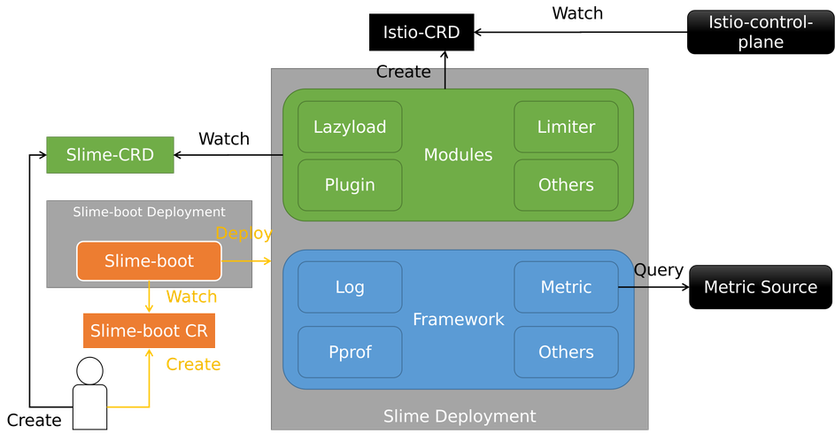

- [智能网格管理器](#智能网格管理器)
  - [为什么选择Slime](#为什么选择slime)
  - [架构](#架构)
  - [教程](#教程)
  - [交流](#交流)
  - [证书](#证书)

# 智能网格管理器

[English](./README_EN.md)

   

---

Slime 定位是服务网格智能管理器，构建在服务网格之上。Slime 专注于以无侵入、智能化方式扩展并增强服务网格的核心功能（流量治理、安全性、可观测性）、性能、稳定性与运维性。Slime 简化业务接入与使用服务网格，并在生产环境大规模稳定运行服务网格提供管理保障。此外，Slime 通过精心设计的扩展机制，使业务不需要对服务网格基础框架进行修改，即可为服务网格赋予智能化使用与运维能力。

## 为什么选择Slime

服务网格作为新一代微服务架构，实现了业务逻辑和微服务治理逻辑的解耦，降低了微服务的开发与运维成本。但我们在帮助业务团队使用服务网格，并进行生产落地的过程中，发现现有服务网格平台仍然存在着许多问题：

- 有些功能缺失或使用门槛太高，导致业务无法顺利接入；
- 大规模业务集群场景下，存在许多稳定性风险；
- 管理员对服务网格的管理与运维困难：需要修改服务网格基础框架来解决问题。这样会改变基础框架的原有逻辑，无法合入社区版本，为开发者长期维护服务网格制造了很多困难。

为此，我们开发了很多的服务网格周边模块，解决了这些问题，保证运行在服务网格之上的企业业务能够平稳运行，并且设计的扩展机制不需要侵入框架原生代码。为了回馈社区，我们系统整理了解决共性问题的核心模块，开源出来，这便有了 Slime 项目。

该项目是基于 k8s-operator 实现的，**可以无缝对接 Istio，无需任何的定制化改造**。

Slime 核心能力包括智能流量管理、智能运维管理、智能扩展管理：

- **智能流量管理**：通过业务流量中的特征内容，升级服务网格流量治理能力，为业务提供更精细化和及时的治理功能  —— 
  - [自适应限流](./staging/src/slime.io/slime/modules/limiter)：实现了本地限流，同时可以结合监控信息自动调整限流策略，填补了传统服务网格限流功能的短板
  - 智能熔断降级
  - 流量染色

- **智能运维管理**：结合服务网格架构下的组件与业务特征，提供更精准、可视化的运维能力和性能稳定性增强 ——
  - [配置懒加载](./staging/src/slime.io/slime/modules/lazyload)：无须配置SidecarScope，自动按需加载配置和服务发现信息 ，解决了全量推送的问题。服务调用关系的来源支持Prometheus或者Accesslog
  - [网格（服务）仓库](./staging/src/slime.io/slime/modules/meshregistry)：帮助istio快速集成各种服务注册中心
  - 文件分发管理（filemanager，后续提供）
  - 命令行交互 [i9s](https://github.com/slime-io/i9s)
  - 巡检（patrol）
  - 排障工具（tracetio）

- **智能插件管理**：针对服务网格缺少高效的插件管理工具的问题，提供批量插件管理能力，简化服务网格数据面插件管理的难度
  - [Http插件管理](./staging/src/slime.io/slime/modules/plugin)：使用新的的CRD pluginmanager/envoyplugin包装了可读性及可维护性差的envoyfilter，使得插件扩展更为便捷。

目前我们开源了自适应限流、配置懒加载、网格（服务）仓库、i9s、Http插件管理，后续我们会开源更多的功能模块。

## 架构

Slime架构主要分为三大块：

1. slime-boot，部署Slime（slime-modules和slime-framework）的Operator组件。
2. slime-modules，Slime的核心线程，感知SlimeCRD并转换为IstioCRD，并触发内置的其他逻辑。
3. slime-framework，作为底座，为modules提供通用的基础能力。

其架构图如下：

Slime支持聚合打包，可以将任意模块聚合成一个镜像。所以，Slime可以以一个Deployment形式部署，避免组件过多。

## 教程

[slime网站](https://slime-io.github.io/)

[Slime镜像信息](https://github.com/slime-io/slime/wiki/Slime-Project-Tag-and-Image-Tag-Mapping-Table)

[Slime-boot安装](./doc/zh/slime-boot.md)

Slime-module

- [懒加载使用](./staging/src/slime.io/slime/modules/lazyload/README.md)
- [插件管理使用](./staging/src/slime.io/slime/modules/plugin/README.md)
- [自适应限流使用](./staging/src/slime.io/slime/modules/limiter/README.md)
- [网格（服务）仓库](./staging/src/slime.io/slime/modules/meshregistry/README_CH.md)

[E2E测试教程](./doc/zh/slime_e2e_test_zh.md)

## 交流

- 微信群： 请添加微信号 `yonka_hust` 进群

- QQ群: 971298863
- Slack: [https://slimeslime-io.slack.com/invite](https://join.slack.com/t/slimeslime-io/shared_invite/zt-u3nyjxww-vpwuY9856i8iVlZsCPtKpg)
- 邮件：slimedotio@gmail.com
- 其他有用的信息可以查阅我们的官网 [Slime-Home](https://slime-io.github.io/)

## 证书

[Apache-2.0](https://choosealicense.com/licenses/apache-2.0/)
