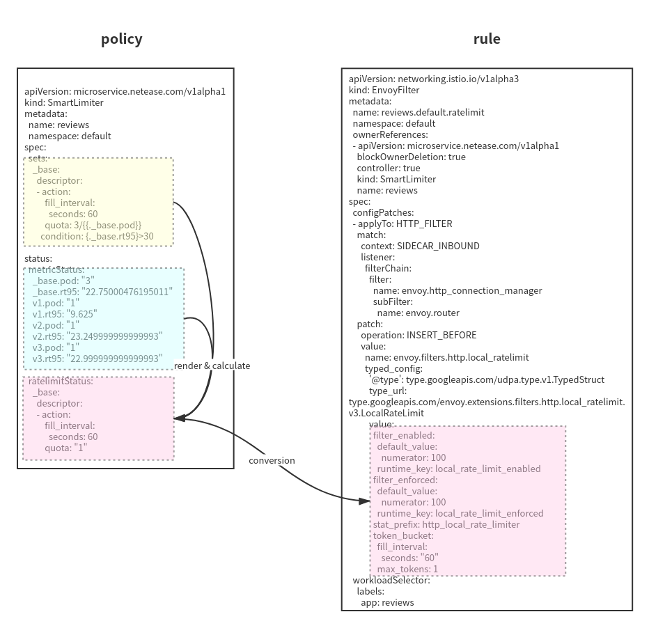

# Slime
## Smart ServiceMesh Manager

[中文](https://github.com/slime-io/slime/blob/master/README_ZH.md)  

    

 [](https://goreportcard.com/report/github.com/slime-io/slime)  

Slime is an intelligent ServiceMesh manager based on istio. Through slime, we can define dynamic service management strategies, so as to achieve the purpose of automatically and conveniently using istio/envoy high-level functions.

**[Configuration Lazy Loading](#configure-lazy-loading):** No need to configure SidecarScope, automatically load configuration on demand.

**[Http Plugin Management](#http-plugin-management):** Use the new CRD pluginmanager/envoyplugin to wrap readability , The poor maintainability of envoyfilter makes plug-in extension more convenient.

**[Adaptive Ratelimit](#adaptive-ratelimit):** It can be automatically combined with adaptive ratelimit strategy based on metrics.

## Architecture
The Slime architecture is mainly divided into three parts:

1. slime-boot，Deploy the operator component of the slime-module, and the slime-module can be deployed quickly and easily through the slime-boot.
2. slime-controller，The core thread of slime-module senses SlimeCRD and converts to IstioCRD.
3. slime-metric，The monitoring acquisition thread of slime-module is used to perceive the service status, and the slime-controller will dynamically adjust the service traffic rules according to the service status.


The user defines the service traffic policy in the CRD spec. At the same time, slime-metric obtains information about the service status from prometheus and records it in the metricStatus of the CRD. After the slime-module controller perceives the service status through metricStatus, it renders the corresponding monitoring items in the service governance policy, calculates the formula in the policy, and finally generates traffic rules.



## How to Use Slime

### Install Slime-boot
You can easily install and uninstall the slime sub-module with slime-boot. Using the following commands to install slime-boot:
```sh
$ kubectl create ns mesh-operator
$ kubectl apply -f https://raw.githubusercontent.com/slime-io/slime/v0.2.0-alpha/install/init/crds.yaml
$ kubectl apply -f https://raw.githubusercontent.com/slime-io/slime/v0.2.0-alpha/install/init/deployment_slime-boot.yaml
```


### Install Prometheus

The lazy load and smart limiter module needs metric data, so we suggest you installing prometheus in your system. Here is a simple prometheus installation file copied from istio.io.

```sh
$ kubectl apply -f https://raw.githubusercontent.com/slime-io/slime/v0.2.0-alpha/install/config/prometheus.yaml
```


### Configure lazy loading

#### Install & Use

Make sure slime-boot has been installed.

1. Install the lazyload module and additional components, through slime-boot configuration:
```yaml
apiVersion: config.netease.com/v1alpha1
kind: SlimeBoot
metadata:
  name: lazyload
  namespace: mesh-operator
spec:
  image:
    pullPolicy: Always
    repository: docker.io/slimeio/slime-lazyload
    tag: v0.2.0-alpha
  module:
    - name: lazyload
      fence:
        enable: true
        wormholePort: 
          - "9080" # replace to your application service ports
          - {{your port}}
      metric:
        prometheus:
          address: http://prometheus.istio-system:9090 # replace to your prometheus address
          handlers:
            destination:
              query: |
                sum(istio_requests_total{source_app="$source_app",reporter="destination"})by(destination_service)
              type: Group
  component:
    globalSidecar:
      enable: true
      type: namespaced
      namespace:
        - default # replace to or add your deployment's namespace
        - {{you namespace}}
      resources:
        requests:
          cpu: 200m
          memory: 200Mi
        limits:
          cpu: 200m
          memory: 200Mi
    pilot:
      enable: true
      resources:
        requests:
          cpu: 200m
          memory: 200Mi
        limits:
          cpu: 200m
          memory: 200Mi
      image:
        repository: docker.io/slimeio/pilot
        tag: preview-1.3.7-v0.0.1
```
2. make sure all components are running
```sh
$ kubectl get po -n mesh-operator
NAME                                    READY     STATUS    RESTARTS   AGE
global-sidecar-pilot-796fb554d7-blbml   1/1       Running   0          27s
lazyload-fbcd5dbd9-jvp2s                1/1       Running   0          27s
slime-boot-68b6f88b7b-wwqnd             1/1       Running   0          39s
```
```sh
$ kubectl get po -n {{your namespace}}
NAME                              READY     STATUS    RESTARTS   AGE
global-sidecar-785b58d4b4-fl8j4   1/1       Running   0          68s
```

3. enable lazyload    

  Apply servicefence resource to enable lazyload.
```yaml
apiVersion: microservice.slime.io/v1alpha1
kind: ServiceFence
metadata:
  name: {{your svc}}
  namespace: {{your namespace}}
spec:
  enable: true
```
4. make sure sidecar has been generated
Execute `kubectl get sidecar {{svc name}} -oyaml`，you can see a sidecar is generated for the corresponding service， as follow：
```yaml
apiVersion: networking.istio.io/v1beta1
kind: Sidecar
metadata:
  name: {{your svc}}
  namespace: {{your ns}}
  ownerReferences:
  - apiVersion: microservice.slime.io/v1alpha1
    blockOwnerDeletion: true
    controller: true
    kind: ServiceFence
    name: {{your svc}}
spec:
  egress:
  - hosts:
    - istio-system/*
    - mesh-operator/*
    - '*/global-sidecar.{your ns}.svc.cluster.local'
  workloadSelector:
    labels:
      app: {{your svc}}
```
#### Other installation options

**Disable global-sidecar**  

In the ServiceMesh with allow_any enabled, the global-sidecar component can be omitted. Use the following configuration:
```yaml
apiVersion: config.netease.com/v1alpha1
kind: SlimeBoot
metadata:
  name: lazyload
  namespace: mesh-operator
spec:
  image:
    pullPolicy: Always
    repository: docker.io/slimeio/slime-lazyload
    tag: v0.2.0-alpha
  module:
    - fence:
        enable: true
        wormholePort:
        - {{port1}} # replace to your application service ports
        - {{port2}}
        - ...
      name: slime-fence
      metric:
        prometheus:
          address: http://prometheus.istio-system:9090 # replace to your prometheus address
          handlers:
            destination:
              query: |
                sum(istio_requests_total{source_app="$source_app",report="destination"})by(destination_service)
              type: Group
```
Not using the global-sidecar component may cause the first call to fail to follow the preset traffic rules.

**Use cluster unique global-sidecar**     

```yaml
apiVersion: config.netease.com/v1alpha1
kind: SlimeBoot
metadata:
  name: lazyload
  namespace: mesh-operator
spec:
  image:
    pullPolicy: Always
    repository: docker.io/slimeio/slime-lazyload
    tag: v0.2.0-alpha
  module:
    - fence:
        enable: true
        wormholePort:
        - {{port1}} # replace to your application service ports
        - {{port2}}
        - ...
      name: slime-fence
      metric:
        prometheus:
          address: http://prometheus.istio-system:9090 # replace to your prometheus address
          handlers:
            destination:
              query: |
                sum(istio_requests_total{source_app="$source_app",report="destination"})by(destination_service)
              type: Group
  component:
    globalSidecar:
      enable: true
      type: cluster
      namespace:
        - default # replace to or add your deployment's namespace
        - {{you namespace}}
    pilot:
      enable: true
      image:
        repository: docker.io/slimeio/pilot
        tag: preview-1.3.7-v0.0.1      
```

**Use report-server to report the dependency**   

When prometheus is not configured in the cluster, the dependency can be reported through report-server.  

```yaml
apiVersion: config.netease.com/v1alpha1
kind: SlimeBoot
metadata:
  name: lazyload
  namespace: mesh-operator
spec:
  image:
    pullPolicy: Always
    repository: docker.io/slimeio/slime-lazyload
    tag: v0.2.0-alpha
  # Default values copied from <project_dir>/helm-charts/slimeboot/values.yaml\
  module:
    - fence:
        enable: true
        wormholePort:
        - {{port1}} # replace to your application service ports 
        - {{port2}}
        - ...
      name: slime-fence
      metric:
        prometheus:
          address: http://prometheus.istio-system:9090 # replace to your prometheus address
          handlers:
            destination:
              query: |
                sum(istio_requests_total{source_app="$source_app",report="destination"})by(destination_service)
              type: Group
  component:
    globalSidecar:
      enable: true
      type: namespaced
      namespace:
        - default # replace to your deployment's namespace
        - {{you namespace}}
    pilot:
      enable: true
      image:
        repository: docker.io/slimeio/pilot
        tag: preview-1.3.7-v0.0.1
    reportServer:
      enable: true
      resources:
        requests:
          cpu: 200m
          memory: 200Mi
        limits:
          cpu: 200m
          memory: 200Mi
      mixerImage:
        repository: docker.io/slimeio/mixer
        tag: preview-1.3.7-v0.0.1
      inspectorImage:
        repository: docker.io/slimeio/report-server
        tag: preview-v0.0.1-rc    
```


#### Example

##### Install Istio (1.8+)


##### Install Slime

```sh
$ /bin/bash -c "$(curl -fsSL https://raw.githubusercontent.com/slime-io/slime/v0.2.0-alpha/install/samples/lazyload/easy_install_lazyload.sh)"
```

Confirm all components are running.

```sh
$ kubectl get slimeboot -n mesh-operator
NAME       AGE
lazyload   2m20s
$ kubectl get pod -n mesh-operator
NAME                                    READY   STATUS             RESTARTS   AGE
global-sidecar-pilot-7bfcdc55f6-977k2   1/1     Running            0          2m25s
lazyload-b9646bbc4-ml5dr                1/1     Running            0          2m25s
slime-boot-7b474c6d47-n4c9k             1/1     Running            0          4m55s
$ kubectl get po -n default
NAME                              READY   STATUS    RESTARTS   AGE
global-sidecar-59f4c5f989-ccjjg   1/1     Running   0          3m9s
```


##### Install Bookinfo

Change the namespace of current-context to which bookinfo will deploy first. Here we use default namespace.

```sh
$ kubectl label namespace default istio-injection=enabled
$ kubectl apply -f https://raw.githubusercontent.com/slime-io/slime/v0.2.0-alpha/install/config/bookinfo.yaml
```

Confirm all pods are running.

```sh
$ kubectl get po -n default
NAME                              READY   STATUS    RESTARTS   AGE
details-v1-79f774bdb9-6vzj6       2/2     Running   0          60s
global-sidecar-59f4c5f989-ccjjg   1/1     Running   0          5m12s
productpage-v1-6b746f74dc-vkfr7   2/2     Running   0          59s
ratings-v1-b6994bb9-klg48         2/2     Running   0          59s
reviews-v1-545db77b95-z5ql9       2/2     Running   0          59s
reviews-v2-7bf8c9648f-xcvd6       2/2     Running   0          60s
reviews-v3-84779c7bbc-gb52x       2/2     Running   0          60s
```

Then we can visit productpage from pod/ratings, executing `curl productpage:9080/productpage`. You can also create gateway and visit productpage from outside, like what shows in  https://istio.io/latest/zh/docs/setup/getting-started/#ip.


##### Enable Lazyload

Create lazyload for productpage.

```sh
$ kubectl apply -f https://raw.githubusercontent.com/slime-io/slime/v0.2.0-alpha/install/samples/lazyload/servicefence_productpage.yaml
```

Confirm servicefence and sidecar already exist.

```sh
$ kubectl get servicefence -n default
NAME          AGE
productpage   12s
$ kubectl get sidecar -n default
NAME          AGE
productpage   22s
$ kubectl get sidecar productpage -n default -oyaml
apiVersion: networking.istio.io/v1beta1
kind: Sidecar
metadata:
  creationTimestamp: "2021-08-04T03:54:35Z"
  generation: 1
  name: productpage
  namespace: default
  ownerReferences:
  - apiVersion: microservice.slime.io/v1alpha1
    blockOwnerDeletion: true
    controller: true
    kind: ServiceFence
    name: productpage
    uid: d36e4be7-d66c-4f77-a9ff-14a4bf4641e6
  resourceVersion: "324118"
  uid: ec283a14-8746-42d3-87d1-0ee4538f0ac0
spec:
  egress:
  - hosts:
    - istio-system/*
    - mesh-operator/*
    - '*/global-sidecar.default.svc.cluster.local'
  workloadSelector:
    labels:
      app: productpage
```


##### First Visit and Observ

Visit the productpage website, and use `kubectl logs -f productpage-xxx -c istio-proxy -n default` to observe the access log of productpage.

```
[2021-08-06T06:04:36.912Z] "GET /details/0 HTTP/1.1" 200 - via_upstream - "-" 0 178 43 43 "-" "Mozilla/5.0 (X11; Linux x86_64) AppleWebKit/537.36 (KHTML, like Gecko) Chrome/92.0.4515.107 Safari/537.36" "48257260-1f5f-92fa-a18f-ff8e2b128487" "details:9080" "172.17.0.17:9080" outbound|9080||global-sidecar.default.svc.cluster.local 172.17.0.11:45422 10.101.207.55:9080 172.17.0.11:56376 - -
[2021-08-06T06:04:36.992Z] "GET /reviews/0 HTTP/1.1" 200 - via_upstream - "-" 0 375 1342 1342 "-" "Mozilla/5.0 (X11; Linux x86_64) AppleWebKit/537.36 (KHTML, like Gecko) Chrome/92.0.4515.107 Safari/537.36" "48257260-1f5f-92fa-a18f-ff8e2b128487" "reviews:9080" "172.17.0.17:9080" outbound|9080||global-sidecar.default.svc.cluster.local 172.17.0.11:45428 10.106.126.147:9080 172.17.0.11:41130 - -
```

It is clearly that the banckend of productpage is global-sidecar.

Now we get the sidecar yaml. Details and reviews are already added into sidecar! 

```YAML
$ kubectl get sidecar productpage -oyaml
apiVersion: networking.istio.io/v1beta1
kind: Sidecar
metadata:
  creationTimestamp: "2021-08-06T03:23:05Z"
  generation: 2
  name: productpage
  namespace: default
  ownerReferences:
  - apiVersion: microservice.slime.io/v1alpha1
    blockOwnerDeletion: true
    controller: true
    kind: ServiceFence
    name: productpage
    uid: 27853fe0-01b3-418f-a785-6e49db0d201a
  resourceVersion: "498810"
  uid: e923e426-f0f0-429a-a447-c6102f334904
spec:
  egress:
  - hosts:
    - '*/details.default.svc.cluster.local'
    - '*/reviews.default.svc.cluster.local'
    - istio-system/*
    - mesh-operator/*
    - '*/global-sidecar.default.svc.cluster.local'
  workloadSelector:
    labels:
      app: productpage
```


##### Second Visit and Observ

Visit the productpage website again, and use `kubectl logs -f productpage-xxx -c istio-proxy -n default` to observe the access log of productpage.

```
[2021-08-06T06:05:47.068Z] "GET /details/0 HTTP/1.1" 200 - via_upstream - "-" 0 178 46 46 "-" "Mozilla/5.0 (X11; Linux x86_64) AppleWebKit/537.36 (KHTML, like Gecko) Chrome/92.0.4515.107 Safari/537.36" "1c1c8e23-24d3-956e-aec0-e4bcff8df251" "details:9080" "172.17.0.6:9080" outbound|9080||details.default.svc.cluster.local 172.17.0.11:58522 10.101.207.55:9080 172.17.0.11:57528 - default
[2021-08-06T06:05:47.160Z] "GET /reviews/0 HTTP/1.1" 200 - via_upstream - "-" 0 379 1559 1558 "-" "Mozilla/5.0 (X11; Linux x86_64) AppleWebKit/537.36 (KHTML, like Gecko) Chrome/92.0.4515.107 Safari/537.36" "1c1c8e23-24d3-956e-aec0-e4bcff8df251" "reviews:9080" "172.17.0.10:9080" outbound|9080||reviews.default.svc.cluster.local 172.17.0.11:60104 10.106.126.147:9080 172.17.0.11:42280 - default
```

The backends are details and reviews now.


##### Uninstall

Uninstall bookinfo.

```sh
$ kubectl delete -f https://raw.githubusercontent.com/slime-io/slime/v0.2.0-alpha/install/config/bookinfo.yaml
```

Uninstall slime.

```sh
$ /bin/bash -c "$(curl -fsSL https://raw.githubusercontent.com/slime-io/slime/v0.2.0-alpha/install/samples/lazyload/easy_uninstall_lazyload.sh)"
```


### Http Plugin Management
#### Install & Use
Use the following configuration to install the HTTP plugin management module:
```yaml
apiVersion: config.netease.com/v1alpha1
kind: SlimeBoot
metadata:
  name: plugin
  namespace: mesh-operator
spec:
  module:
    - name: plugin
      plugin:
        enable: true
  image:
    pullPolicy: Always
    repository: docker.io/slimeio/slime-plugin
    tag: v0.2.0-alpha
```


#### Inline plugin

**Note:** Envoy binary needs to support extension plugins
**enable/disable**
Configure PluginManager in the following format to open the built-in plugin:
```yaml
apiVersion: microservice.slime.io/v1alpha1
kind: PluginManager
metadata:
  name: reviews-pm
  namespace: default
spec:
  workload_labels:
    app: reviews
  plugins:
  - enable: true
    name: {plugin-1}     # plugin name
  # ...
  - enable: true
    name: {plugin-N}
```
{plugin-N} is the name of the plug-in, and the sort in PluginManager is the execution order of the plug-in. Set the enable field to false to disable the plugin.


**Global configuration**

The global configuration corresponds to the plug-in configuration in LDS. Set the global configuration in the following format:
```yaml
apiVersion: microservice.slime.io/v1alpha1
kind: PluginManager
metadata:
  name: my-plugin
  namespace: default
spec:
  workload_labels:
    app: my-app
  plugins:
  - enable: true          # switch
    name: {plugin-1}      # plugin name
    inline:
      settings:
        {plugin settings} # plugin settings
  # ...
  - enable: true
    name: {plugin-N}
```


#### PluginManager Example

Use the yaml file below to create plugin manager, and enable the plugin reviews-ep

```yaml
apiVersion: microservice.slime.io/v1alpha1
kind: PluginManager
metadata:
  name: reviews-pm
  namespace: default
spec:
  workload_labels:
    app: reviews
  plugins:
  - enable: true
    name: reviews-ep     # plugin name
    inline:
      settings:
        rate_limits:
        - actions:
          - header_value_match:
              descriptor_value: Service[a.powerful]-User[none]-Gateway[null]-Api[null]-Id[hash:-1414739194]
              headers:
              - invert_match: false
                name: testaaa
                safe_regex_match:
                  google_re2: {}
                  regex: testt
          stage: 0
```

And you will get the envoyfilter

```yaml
$ kubectl -n default get envoyfilter reviews-pm -oyaml
apiVersion: networking.istio.io/v1alpha3
kind: EnvoyFilter
metadata:
  creationTimestamp: "2021-08-26T08:20:56Z"
  generation: 1
  name: reviews-pm
  namespace: default
  ownerReferences:
  - apiVersion: microservice.slime.io/v1alpha1
    blockOwnerDeletion: true
    controller: true
    kind: PluginManager
    name: reviews-pm
    uid: 00a65d02-4025-4d0c-a08a-0a8901cd0fa2
  resourceVersion: "658741"
  uid: 2e8c8a96-fc0d-4e92-9f7a-e3336a53a806
spec:
  configPatches:
  - applyTo: HTTP_FILTER
    match:
      context: SIDECAR_OUTBOUND
      listener:
        filterChain:
          filter:
            name: envoy.http_connection_manager
            subFilter:
              name: envoy.router
    patch:
      operation: INSERT_BEFORE
      value:
        name: reviews-ep
        typed_config:
          '@type': type.googleapis.com/udpa.type.v1.TypedStruct
          type_url: ""
          value:
            rate_limits:
            - actions:
              - header_value_match:
                  descriptor_value: Service[a.powerful]-User[none]-Gateway[null]-Api[null]-Id[hash:-1414739194]
                  headers:
                  - invert_match: false
                    name: testaaa
                    safe_regex_match:
                      google_re2: {}
                      regex: testt
              stage: 0
  workloadSelector:
    labels:
      app: reviews
```


#### EnvoyPlugin Example

Use the yaml file below to create envoy plugin

```yaml
apiVersion: microservice.slime.io/v1alpha1
kind: EnvoyPlugin
metadata:
  name: reviews-ep
  namespace: default
spec:
  workloadSelector:
    labels:
      app: reviews
  route:
    - inbound|http|80/default
  plugins:
  - name: envoy.ratelimit
    inline:
      settings:
        rate_limits:
        - actions:
          - header_value_match:
              descriptor_value: Service[a.powerful]-User[none]-Gateway[null]-Api[null]-Id[hash:-1414739194]
              headers:
              - invert_match: false
                name: testaaa
                safe_regex_match:
                  google_re2: {}
                  regex: testt
          stage: 0
```

And you will get the envoyfilter

```yaml
$ kubectl -n default get envoyfilter reviews-ep -oyaml
apiVersion: networking.istio.io/v1alpha3
kind: EnvoyFilter
metadata:
  creationTimestamp: "2021-08-26T08:13:56Z"
  generation: 1
  name: reviews-ep
  namespace: default
  ownerReferences:
  - apiVersion: microservice.slime.io/v1alpha1
    blockOwnerDeletion: true
    controller: true
    kind: EnvoyPlugin
    name: reviews-ep
    uid: fcf9d63b-115f-4a2a-bfc4-40d5ce1bcfee
  resourceVersion: "658067"
  uid: 762768a7-48ae-4939-afa3-f687e0cca826
spec:
  configPatches:
  - applyTo: HTTP_ROUTE
    match:
      routeConfiguration:
        vhost:
          name: inbound|http|80
          route:
            name: default
    patch:
      operation: MERGE
      value:
        route:
          rate_limits:
          - actions:
            - header_value_match:
                descriptor_value: Service[a.powerful]-User[none]-Gateway[null]-Api[null]-Id[hash:-1414739194]
                headers:
                - invert_match: false
                  name: testaaa
                  safe_regex_match:
                    google_re2: {}
                    regex: testt
            stage: 0
  workloadSelector:
    labels:
      app: reviews
```


### Adaptive Ratelimit

#### Install & Use

Make sure slime-boot has been installed.

Install the limiter module, through slime-boot:
```yaml
apiVersion: config.netease.com/v1alpha1
kind: SlimeBoot
metadata:
  name: smartlimiter
  namespace: mesh-operator
spec:
  image:
    pullPolicy: Always
    repository: docker.io/slimeio/slime-limiter
    tag: v0.2.0-alpha
  module:
    - limiter:
        enable: true
        backend: 1
      metric:
        prometheus:
          address: http://prometheus.istio-system:9090 # replace to your prometheus address
          handlers:
            cpu.sum:
              query: |
                sum(container_cpu_usage_seconds_total{namespace="$namespace",pod=~"$pod_name",image=""})
            cpu.max:
              query: |
                max(container_cpu_usage_seconds_total{namespace="$namespace",pod=~"$pod_name",image=""})
            rt99:
              query: |
                histogram_quantile(0.99, sum(rate(istio_request_duration_milliseconds_bucket{kubernetes_pod_name=~"$pod_name"}[2m]))by(le))
        k8s:
          handlers:
            - pod # inline
      name: limiter   
```
In the example, we configure prometheus as the monitoring source, and "prometheus handlers" defines the attributes that we want to obtain from monitoring. These attributes can be used as parameters in the traffic rules to achieve the purpose of adaptive ratelimit. 
Users can also define the monitoring attributes that the limiter module needs to obtain according to their needs. The following are some commonly used statements for obtaining monitoring attributes:

```
CPU:
Sum：
sum(container_cpu_usage_seconds_total{namespace="$namespace",pod=~"$pod_name",image=""})
Max：
max(container_cpu_usage_seconds_total{namespace="$namespace",pod=~"$pod_name",image=""})
Limit:
container_spec_cpu_quota{pod=~"$pod_name"}

Memory：
Sum：
sum(container_memory_usage_bytes{namespace="$namespace",pod=~"$pod_name",image=""})
Max：
max(container_memory_usage_bytes{namespace="$namespace",pod=~"$pod_name",image=""})
Limit:
sum(container_spec_memory_limit_bytes{pod=~"$pod_name"})

Request Duration：
90：
histogram_quantile(0.90, sum(rate(istio_request_duration_milliseconds_bucket{kubernetes_pod_name=~"$pod_name"}[2m]))by(le))
95：
histogram_quantile(0.95, sum(rate(istio_request_duration_milliseconds_bucket{kubernetes_pod_name=~"$pod_name"}[2m]))by(le))
99：
histogram_quantile(0.99, sum(rate(istio_request_duration_milliseconds_bucket{kubernetes_pod_name=~"$pod_name"}[2m]))by(le))
```


####  Adaptive ratelimit based on metrics

The metrics information entry can be configured in `condition`. The data from prometheus shows in metricStatus.

Deploy

```yaml
apiVersion: microservice.slime.io/v1alpha1
kind: SmartLimiter
metadata:
  name: reviews
  namespace: default
spec:
  sets:
    v2:
      descriptor:
      - action:
          fill_interval:
            seconds: 60
          quota: "1"
        condition: '{{.v2.cpu.sum}}>10'
```

Get

```yaml
apiVersion: microservice.slime.io/v1alpha1
kind: SmartLimiter
metadata:
  annotations:
    kubectl.kubernetes.io/last-applied-configuration: |
      {"apiVersion":"microservice.slime.io/v1alpha1","kind":"SmartLimiter","metadata":{"annotations":{},"name":"reviews","namespace":"default"},"spec":{"sets":{"v2":{"descriptor":[{"action":{"fill_interval":{"seconds":60},"quota":"1"},"condition":"{{.v2.cpu.sum}}\u003e100"}]}}}}
  creationTimestamp: "2021-08-09T07:54:24Z"
  generation: 1
  name: reviews
  namespace: default
  resourceVersion: "63006"
  uid: e6bf5121-6126-40db-8f5c-e124894b5d54
spec:
  sets:
    v2:
      descriptor:
      - action:
          fill_interval:
            seconds: 60
          quota: "1"
        condition: '{{.v2.cpu.sum}}>100'
status:
  metricStatus:
    _base.cpu.max: "181.591794594"
    _base.cpu.sum: "536.226646691"
    _base.pod: "3"
    v1.cpu.max: "176.285405855"
    v1.cpu.sum: "176.285405855"
    v1.pod: "1"
    v2.cpu.max: "178.349446242"
    v2.cpu.sum: "178.349446242"
    v2.pod: "1"
    v3.cpu.max: "181.591794594"
    v3.cpu.sum: "181.591794594"
    v3.pod: "1"
  ratelimitStatus:
    v2:
      descriptor:
      - action:
          fill_interval:
            seconds: 60
          quota: "1"
```

The formula in the condition will be rendered according to the entry of endPointStatus. If the result of the rendered formula is true, the limit will be triggered.


#### Subset RateLimit

In istio's system, users can define subsets for services through DestinationRule, and customize service traffic rules such as load balancing and connection pooling for them. RateLimit also belongs to this kind of service traffic rules. Through the slime framework, we can not only customize the rateLimit rules for services, but also for subsets, as shown below:

```yaml
apiVersion: microservice.slime.io/v1alpha1
kind: SmartLimiter
metadata:
  name: reviews
  namespace: default
spec:
  sets:
    v1: # reviews v1
      descriptor:
      - action:
          fill_interval:
            seconds: 60
          quota: "1"
        condition: "true"
```
The above configuration limits 1 requests per minute for the v1 version of the reviews service. After submitting the configuration, the status information and ratelimit information of the instance under the service will be displayed in `status`, as follows:

```yaml
apiVersion: microservice.slime.io/v1alpha1
kind: SmartLimiter
metadata:
  annotations:
    kubectl.kubernetes.io/last-applied-configuration: |
      {"apiVersion":"microservice.slime.io/v1alpha1","kind":"SmartLimiter","metadata":{"annotations":{},"name":"reviews","namespace":"default"},"spec":{"sets":{"v1":{"descriptor":[{"action":{"fill_interval":{"seconds":60},"quota":"1"},"condition":"true"}]}}}}
  creationTimestamp: "2021-08-09T07:06:42Z"
  generation: 1
  name: reviews
  namespace: default
  resourceVersion: "59635"
  uid: ba62ff40-3c9f-427d-959b-6a416d54f24c
spec:
  sets:
    v1:
      descriptor:
      - action:
          fill_interval:
            seconds: 60
          quota: "1"
        condition: "true"
status:
  metricStatus:
    _base.cpu.max: "158.942939832"
    _base.cpu.sum: "469.688066909"
    _base.pod: "3"
    v1.cpu.max: "154.605786157"
    v1.cpu.sum: "154.605786157"
    v1.pod: "1"
    v2.cpu.max: "156.13934092"
    v2.cpu.sum: "156.13934092"
    v2.pod: "1"
    v3.cpu.max: "158.942939832"
    v3.cpu.sum: "158.942939832"
    v3.pod: "1"
  ratelimitStatus:
    v1:
      descriptor:
      - action:
          fill_interval:
            seconds: 60
          quota: "1"
```


#### Service ratelimit
Due to the lack of global quota management components, we cannot achieve precise service ratelimit, but assuming that the load balance is ideal, 
(instance quota) = (service quota)/(the number of instances). The service quota of test-svc is 3, then the quota field can be configured to 3/{pod} to achieve service-level ratelimit. When the service is expanded, you can see the change of the instance quota in status.

Deploy

```yaml
apiVersion: microservice.slime.io/v1alpha1
kind: SmartLimiter
metadata:
  name: reviews
  namespace: default
spec:
  sets:
    _base:
      descriptor:
      - action:
          fill_interval:
            seconds: 60
          quota: 3/{{._base.pod}}
        condition: "true"
```

Get

```yaml
apiVersion: microservice.slime.io/v1alpha1
kind: SmartLimiter
metadata:
  annotations:
    kubectl.kubernetes.io/last-applied-configuration: |
      {"apiVersion":"microservice.slime.io/v1alpha1","kind":"SmartLimiter","metadata":{"annotations":{},"name":"reviews","namespace":"default"},"spec":{"sets":{"_base":{"descriptor":[{"action":{"fill_interval":{"seconds":60},"quota":"3/{{._base.pod}}"},"condition":"true"}]}}}}
  creationTimestamp: "2021-08-09T08:21:11Z"
  generation: 1
  name: reviews
  namespace: default
  resourceVersion: "65036"
  uid: 16fc8c81-f71a-45ae-be1f-8f38d9a1fe4b
spec:
  sets:
    _base:
      descriptor:
      - action:
          fill_interval:
            seconds: 60
          quota: 3/{{._base.pod}}
        condition: "true"
status:
  metricStatus:
    _base.cpu.max: "192.360021503"
    _base.cpu.sum: "566.4194305139999"
    _base.pod: "3"
    v1.cpu.max: "185.760390031"
    v1.cpu.sum: "185.760390031"
    v1.pod: "1"
    v2.cpu.max: "188.29901898"
    v2.cpu.sum: "188.29901898"
    v2.pod: "1"
    v3.cpu.max: "192.360021503"
    v3.cpu.sum: "192.360021503"
    v3.pod: "1"
  ratelimitStatus:
    _base:
      descriptor:
      - action:
          fill_interval:
            seconds: 60
          quota: "1" # For each instance, the current limit quota is 3/3=1.
```


#### Example

##### Install istio (1.8+)


##### Install slime

```sh
$ /bin/bash -c "$(curl -fsSL https://raw.githubusercontent.com/slime-io/slime/v0.2.0-alpha/install/samples/smartlimiter/easy_install_limiter.sh)"
```


##### Install Bookinfo

Change the namespace of current-context to which bookinfo will deploy first. Here we use default namespace.

```sh
$ kubectl label namespace default istio-injection=enabled
$ kubectl apply -f https://raw.githubusercontent.com/slime-io/slime/v0.2.0-alpha/install/config/bookinfo.yaml
```

Then we can visit productpage from pod/ratings, executing `curl productpage:9080/productpage`. You can also create gateway and visit productpage from outside, like what shows in  https://istio.io/latest/zh/docs/setup/getting-started/#ip.

Create DestinationRule for reviews.

```sh
$ kubectl apply -f https://raw.githubusercontent.com/slime-io/slime/v0.2.0-alpha/install/config/reviews-destination-rule.yaml
```


##### Create Smartlimiter

```sh
$ kubectl apply -f https://raw.githubusercontent.com/slime-io/slime/v0.2.0-alpha/install/samples/smartlimiter/smartlimiter_reviews.yaml
```


##### Observ Smartlimiter

```sh
$ kubectl get smartlimiter reviews -oyaml
apiVersion: microservice.slime.io/v1alpha1
kind: SmartLimiter
metadata:
  annotations:
    kubectl.kubernetes.io/last-applied-configuration: |
      {"apiVersion":"microservice.slime.io/v1alpha1","kind":"SmartLimiter","metadata":{"annotations":{},"name":"reviews","namespace":"default"},"spec":{"sets":{"v2":{"descriptor":[{"action":{"fill_interval":{"seconds":60},"quota":"1"},"condition":"{{.v2.cpu.sum}}\u003e100"}]}}}}
  creationTimestamp: "2021-08-09T07:54:24Z"
  generation: 1
  name: reviews
  namespace: default
  resourceVersion: "63006"
  uid: e6bf5121-6126-40db-8f5c-e124894b5d54
spec:
  sets:
    v2:
      descriptor:
      - action:
          fill_interval:
            seconds: 60
          quota: "1"
        condition: '{{.v2.cpu.sum}}>100'
status:
  metricStatus:
    _base.cpu.max: "181.591794594"
    _base.cpu.sum: "536.226646691"
    _base.pod: "3"
    v1.cpu.max: "176.285405855"
    v1.cpu.sum: "176.285405855"
    v1.pod: "1"
    v2.cpu.max: "178.349446242"
    v2.cpu.sum: "178.349446242"
    v2.pod: "1"
    v3.cpu.max: "181.591794594"
    v3.cpu.sum: "181.591794594"
    v3.pod: "1"
  ratelimitStatus:
    v2:
      descriptor:
      - action:
          fill_interval:
            seconds: 60
          quota: "1"
```


##### Observ Envoyfilter

```sh
$ kubectl get envoyfilter reviews.default.v2.ratelimit -oyaml
apiVersion: networking.istio.io/v1alpha3
kind: EnvoyFilter
metadata:
  creationTimestamp: "2021-08-09T07:54:25Z"
  generation: 1
  name: reviews.default.v2.ratelimit
  namespace: default
  ownerReferences:
  - apiVersion: microservice.slime.io/v1alpha1
    blockOwnerDeletion: true
    controller: true
    kind: SmartLimiter
    name: reviews
    uid: e6bf5121-6126-40db-8f5c-e124894b5d54
  resourceVersion: "62926"
  uid: cbea7344-3fda-4a1d-b3d2-93649ce76129
spec:
  configPatches:
  - applyTo: HTTP_FILTER
    match:
      context: SIDECAR_INBOUND
      listener:
        filterChain:
          filter:
            name: envoy.http_connection_manager
            subFilter:
              name: envoy.router
    patch:
      operation: INSERT_BEFORE
      value:
        name: envoy.filters.http.local_ratelimit
        typed_config:
          '@type': type.googleapis.com/udpa.type.v1.TypedStruct
          type_url: type.googleapis.com/envoy.extensions.filters.http.local_ratelimit.v3.LocalRateLimit
          value:
            filter_enabled:
              default_value:
                numerator: 100
              runtime_key: local_rate_limit_enabled
            filter_enforced:
              default_value:
                numerator: 100
              runtime_key: local_rate_limit_enforced
            stat_prefix: http_local_rate_limiter
            token_bucket:
              fill_interval:
                seconds: "60"
              max_tokens: 1
  workloadSelector:
    labels:
      app: reviews
      version: v2
```


##### Visit and Observ

Get accesslog of productpage

```
[2021-08-09T08:01:04.872Z] "GET /reviews/0 HTTP/1.1" 429 - via_upstream - "-" 0 18 1 1 "-" "Mozilla/5.0 (X11; Linux x86_64) AppleWebKit/537.36 (KHTML, like Gecko) Chrome/92.0.4515.107 Safari/537.36" "19605264-5868-9c90-8b42-424790fad1b2" "reviews:9080" "172.17.0.11:9080" outbound|9080||reviews.default.svc.cluster.local 172.17.0.16:41342 10.100.112.212:9080 172.17.0.16:41378 - default
```

Get accesslog of review-v2

```
[2021-08-09T08:01:04.049Z] "GET /reviews/0 HTTP/1.1" 429 - local_rate_limited - "-" 0 18 0 - "-" "Mozilla/5.0 (X11; Linux x86_64) AppleWebKit/537.36 (KHTML, like Gecko) Chrome/92.0.4515.107 Safari/537.36" "3f0a65c8-1c66-9994-a0cf-1d7ae0446371" "reviews:9080" "-" inbound|9080|| - 172.17.0.11:9080 172.17.0.16:41342 outbound_.9080_._.reviews.default.svc.cluster.local -
```

Response code is 429. The smartlimiter is working.


##### Uninstall

Uninstall bookinfo.

```sh
$ kubectl delete -f https://raw.githubusercontent.com/slime-io/slime/v0.2.0-alpha/install/config/bookinfo.yaml
$ kubectl delete -f https://raw.githubusercontent.com/slime-io/slime/v0.2.0-alpha/install/config/reviews-destination-rule.yaml
```

Uninstall slime.

```sh
$ /bin/bash -c "$(curl -fsSL https://raw.githubusercontent.com/slime-io/slime/v0.2.0-alpha/install/samples/smartlimiter/easy_uninstall_limiter.sh)"
```


## Community

- Slack: [https://slimeslime-io.slack.com/invite](https://join.slack.com/t/slimeslime-io/shared_invite/zt-u3nyjxww-vpwuY9856i8iVlZsCPtKpg)

- QQ Group: 971298863 

   

  

