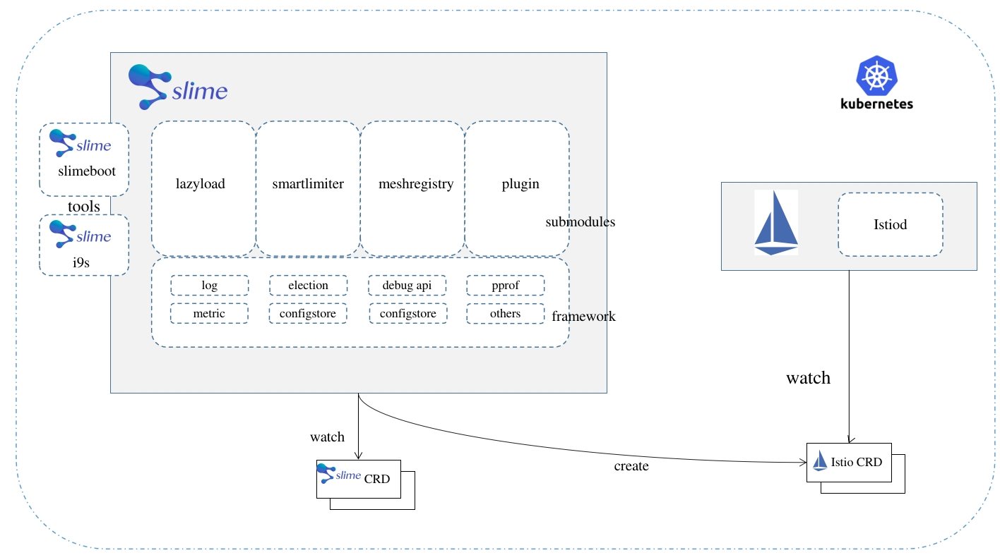

- [Smart ServiceMesh Manager](#smart-servicemesh-manager)
  - [Why Slime](#why-slime)
  - [Architecture](#architecture)
  - [Tutorials](#tutorials)
  - [Community](#community)
  - [License](#license)

# Smart ServiceMesh Manager

[中文](./README.md)

    

   

Slime is an intelligent ServiceMesh manager based on Istio that allows you to define dynamic service management strategies. It helps automate and simplify the use of Istio/Envoy high-level functions.

## Why Slime

Slime optimizes ServiceMesh in the following aspects:

- Enhanced functionality: Slime addresses the issue of missing functionality and high usage threshold in ServiceMesh, ensuring successful access to required features.
- Stability in large-scale scenarios: Slime focuses on mitigating stability risks in large-scale business cluster scenarios, ensuring smooth operation in such environments.
- Simplified management and operation: Slime streamlines the management and operation of ServiceMesh for administrators. It solves the problem of modifying the service mesh base framework, which avoids altering the original logic and provides easier long-term maintenance for developers.

In order to optimize ServiceMesh, we have developed various peripheral modules that address these issues and ensure smooth operation of enterprise businesses built on top of ServiceMesh. These modules are designed with extension mechanisms that do not require modifying the underlying framework's native code. As a way to contribute to the community, we have systematically compiled core modules that solve common problems and open-sourced them, resulting in the Slime project.

The Slime project is built on the k8s-operator implementation, providing seamless integration with Istio without any customization.

The core capabilities of Slime include intelligent traffic management, intelligent operation and maintenance management, and intelligent plugin management.

- **Intelligent Traffic Management**: To enhance the traffic governance capabilities of ServiceMesh, we can upgrade the system to analyze the distinctive content of business traffic. This upgrade will provide more refined and timely governance functions for businesses
  - [Adaptive Rate Limiting](./staging/src/slime.io/slime/modules/limiter): realizes local rate limiting, and at the same time can automatically adjust the rate limiting policy in conjunction with monitoring information, filling the shortcomings of the traditional ServiceMesh rate limiting function
  - Intelligent degradation
  - Traffic mark

- **Intelligent O&M Management**: Combining the components and business features under the ServiceMesh architecture to provide more accurate and visualized O&M capabilities and performance stability enhancement
  - [configure lazy loading](./staging/src/slime.io/slime/modules/lazyload): no need to configure SidecarScope, automatically load configuration and service discovery information on demand, solving the problem of full volume push. The source of the service call relationship supports Prometheus or Accesslog
  - [mesh(service) repository](./staging/src/slime.io/slime/modules/meshregistry): helps istio to quickly integrate various service registries
  - File distribution management (filemanager, to be provided later)
  - Command line interaction [i9s](https://github.com/slime-io/i9s)
  - Patrol (patrol)
  - Troubleshooting tools (tracetio)

- **Intelligent plugin management**: for the lack of efficient plugin management tools for the service mesh, to provide bulk plugin management capabilities to simplify the difficulty of managing plug-ins on the data surface of the service mesh
  - [Http plugin management](./staging/src/slime.io/slime/modules/plugin): using the new CRD pluginmanager/envoyplugin wraps the poor readability and maintainability envoyfilter, making it easier to extend the plugin.

  
## Architecture

The Slime architecture is mainly divided into three parts:

1. slime-boot，the operator component which can deploy Slime (slime-modules and slime-framework).
2. slime-modules，core processes of Slime, watch Slime CRD and convert to Istio CRD, and process other built-in logic.
3. slime-framework, as a base, provide generic base capabilities for modules.

Slime supports aggregated packaging, allowing any module to be aggregated into a single image. So Slime can be deployed as a single deployment, avoiding too many components.

## Tutorials

[Slime Website](https://slime-io.github.io/)

[Slime Image Info](https://github.com/slime-io/slime/wiki/Slime-Project-Tag-and-Image-Tag-Mapping-Table)

[Slime-boot Install](./doc/en/slime-boot.md)

Slime-module

- [Lazyload Usage](./staging/src/slime.io/slime/modules/lazyload/README_EN.md)
- [PluginManager Usage](./staging/src/slime.io/slime/modules/plugin/README_EN.md)
- [SmartLimiter Usage](./staging/src/slime.io/slime/modules/limiter/README_EN.md)
- [MeshRegistry Usage](./staging/src/slime.io/slime/modules/meshregistry/README_EN.md)

[E2E测试教程](./doc/zh/slime_e2e_test_zh.md)

## Contributing

Slime is an open source project and we love contributions. [CONTRIBUTING_GUILDLINES](./CONTRIBUTING_GUILDLINES.md) is a guide that will help you get started.

[CONTRIBUTING_GUILDLINES]()。

## Who is using Slime

We encourage you to submit a comment on this issue to include your use case: [#190](https://github.com/slime-io/slime/issues/190)

## Community

- QQ Group: 971298863
- Slack: [https://slimeslime-io.slack.com/invite](https://join.slack.com/t/slimeslime-io/shared_invite/zt-u3nyjxww-vpwuY9856i8iVlZsCPtKpg)
- email: slimedotio@gmail.com
- You'll find many other useful documents on our official web [Slime-Home](https://slime-io.github.io/)

## License

Under [Apache-2.0](https://choosealicense.com/licenses/apache-2.0/)

## Conduct

We follow the [CNCF Community Code of Conduct](https://github.com/cncf/foundation/blob/master/code-of-conduct.md).
