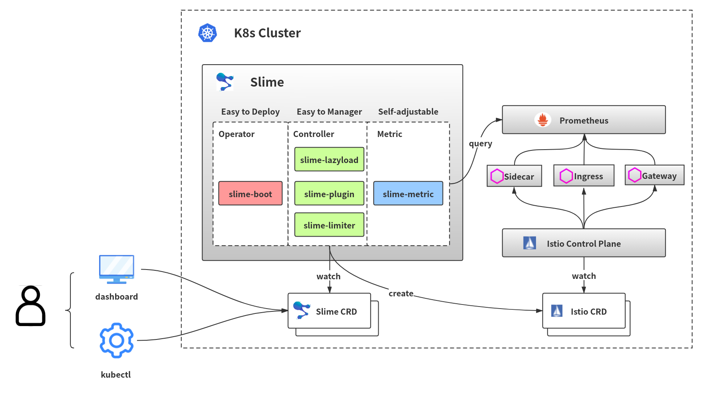
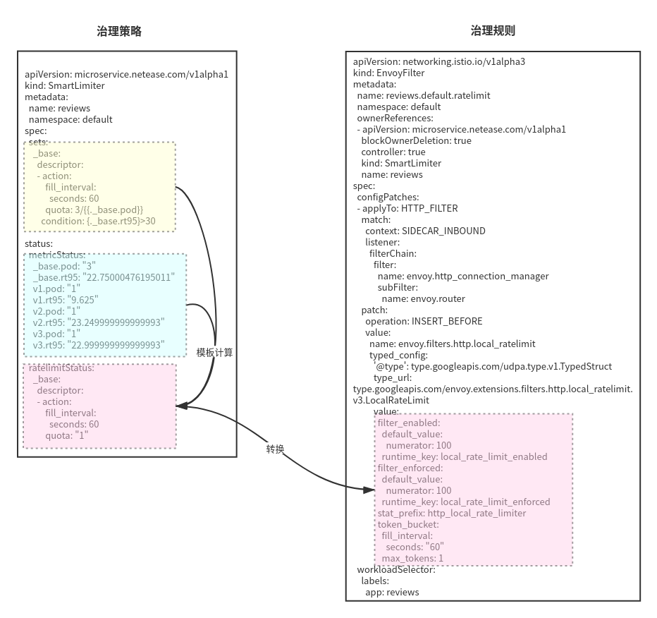

# Slime 
# 智能网格管理器 


---
slime是基于istio的智能网格管理器，通过slime，我们可以定义动态的服务治理策略，从而达到自动便捷使用istio/envoy高阶功能的目的。目前slime包含了三个子模块：

**[配置懒加载](#配置懒加载):** 无须配置SidecarScope，自动按需加载配置/服务发现信息  

**[Http插件管理](#http插件管理):** 使用新的的CRD pluginmanager/envoyplugin包装了可读性，可维护性差的envoyfilter,使得插件扩展更为便捷  

**[自适应限流](#自适应限流):** 实现了本地限流，同时可以结合监控信息自动调整限流策略

后续我们会开放更多的功能模块~

## 架构
Slime架构主要分为三大块：

1. slime-boot，部署slime-module的operator组件，通过slime-boot可以便捷快速的部署slime-module。
2. slime-controller，slime-module的核心线程，感知SlimeCRD并转换为IstioCRD。
3. slime-metric，slime-module的监控获取线程，用于感知服务状态，slime-controller会根据服务状态动态调整服务治理规则。

其架构图如下：



使用者将服务治理策略定义在CRD的spec中，同时，slime-metric从prometheus获取关于服务状态信息，并将其记录在CRD的metricStatus中。slime-module的控制器通过metricStatus感知服务状态后，将服务治理策略中将对应的监控项渲染出，并计算策略中的算式，最终生成治理规则。


## 如何使用Slime
### 安装slime-boot
在使用slime之前，需要安装slime-boot，通过slime-boot，可以方便的安装和卸载slime模块。 执行如下命令：
```
kubectl create ns mesh-operator
kubectl apply -f https://raw.githubusercontent.com/ydh926/slime/master/install/crds.yaml
kubectl apply -f https://raw.githubusercontent.com/ydh926/slime/master/install/slime-boot-install.yaml
```

### 配置懒加载
#### 安装和使用

**请先按照[安装slime-boot](#安装slime-boot)小节的指引安装`slime-boot`**     

1. 使用Slime的配置懒加载功能需打开Fence模块，同时安装附加组件，如下：
```yaml
apiVersion: config.netease.com/v1alpha1
kind: SlimeBoot
metadata:
  name: lazyload
  namespace: mesh-operator
spec:
  # Default values copied from <project_dir>/helm-charts/slimeboot/values.yaml\
  module:
    - fence:
        enable: true
        wormholePort:
        - {{port1}} # 业务svc的端口
        - {{port2}}
        - ...
      name: slime-fence
      metric:
        prometheus:
          address: #http://prometheus_address
          handlers:
            destination:
              query: |
                sum(istio_requests_total{source_app="$source_app",report="destination"})by(destination_service)
              type: Group
  component:
    globalSidecar:
      enable: true
      type: namespaced
      namespace:
        - default # 替换为业务所在的namespace
        - {{you namespace}}
    pilot:
      enable: true
      image:
        repository: docker.io/bcxq/pilot
        tag: preview-1.3.7-v0.0.1
```
2. 确认所有组件已正常运行：
```
$ kubectl get po -n mesh-operator
NAME                                    READY     STATUS    RESTARTS   AGE
global-sidecar-pilot-796fb554d7-blbml   1/1       Running   0          27s
lazyload-fbcd5dbd9-jvp2s                1/1       Running   0          27s
slime-boot-68b6f88b7b-wwqnd             1/1       Running   0          39s
```
```
$ kubectl get po -n {{your namespace}}
NAME                              READY     STATUS    RESTARTS   AGE
global-sidecar-785b58d4b4-fl8j4   1/1       Running   0          68s
```
3. 打开配置懒加载：
在namespace上打上`istio-dependency-servicefence=true`的标签。
```shell
kubectl label ns {{your namespace}} istio-dependency-servicefence=true
```
为需要开启懒加载的服务打上标签`istio.dependency.servicefence/status: "true"`。
```shell
kubectl annotate svc {{your svc}} istio.dependency.servicefence/status=true
```
4. 确认懒加载已开启
执行`kubectl get sidecar {{svc name}} -oyaml`，可以看到对应服务生成了一个sidecar，如下：
```yaml
apiVersion: networking.istio.io/v1beta1
kind: Sidecar
metadata:
  name: {{your svc}}
  namespace: {{your ns}}
  ownerReferences:
  - apiVersion: microservice.netease.com/v1alpha1
    blockOwnerDeletion: true
    controller: true
    kind: ServiceFence
    name: {{your svc}}
spec:
  egress:
  - hosts:
    - istio-system/*
    - mesh-operator/*
    - '*/global-sidecar.{{your ns}}.svc.cluster.local'
  workloadSelector:
    labels:
      app: {{your svc}}
```

#### 其他安装选项

**不使用global-sidecar组件**  
在开启allow_any的网格中，可以不使用global-sidecar组件。使用如下配置：
```yaml
apiVersion: config.netease.com/v1alpha1
kind: SlimeBoot
metadata:
  name: lazyload
  namespace: mesh-operator
spec:
  module:
    - fence:
        enable: true
        wormholePort:
        - {{port1}} # 业务svc的端口
        - {{port2}}
        - ...
      name: slime-fence
      metric:
        prometheus:
          address: #http://prometheus_address
          handlers:
            destination:
              query: |
                sum(istio_requests_total{source_app="$source_app",report="destination"})by(destination_service)
              type: Group
```
不使用global-sidecar组件可能会导致首次调用无法按照预先设定的路由规则进行。   

**使用集群唯一的global-sidecar**   
```yaml
apiVersion: config.netease.com/v1alpha1
kind: SlimeBoot
metadata:
  name: lazyload
  namespace: mesh-operator
spec:
  module:
    - fence:
        enable: true
        wormholePort:
        - {{port1}} # 业务svc的端口
        - {{port2}}
        - ...
      name: slime-fence
      metric:
        prometheus:
          address: #http://prometheus_address
          handlers:
            destination:
              query: |
                sum(istio_requests_total{source_app="$source_app",report="destination"})by(destination_service)
              type: Group
  component:
    globalSidecar:
      enable: true
      type: cluster
      namespace:
        - default # 替换为业务所在的namespace
        - {{you namespace}}
    pilot:
      enable: true
      image:
        repository: docker.io/bcxq/pilot
        tag: preview-1.3.7-v0.0.1      
```

**使用report-server上报调用关系**   
集群内未配置prometheus时，可通过report-server上报依赖关系   
```yaml
apiVersion: config.netease.com/v1alpha1
kind: SlimeBoot
metadata:
  name: lazyload
  namespace: mesh-operator
spec:
  # Default values copied from <project_dir>/helm-charts/slimeboot/values.yaml\
  module:
    - fence:
        enable: true
        wormholePort:
        - {{port1}} # 业务svc的端口
        - {{port2}}
        - ...
      name: slime-fence
      metric:
        prometheus:
          address: #http://prometheus_address
          handlers:
            destination:
              query: |
                sum(istio_requests_total{source_app="$source_app",report="destination"})by(destination_service)
              type: Group
  component:
    globalSidecar:
      enable: true
      type: namespaced
      namespace:
        - default # 替换为业务所在的namespace
        - {{you namespace}}
    pilot:
      enable: true
      image:
        repository: docker.io/bcxq/pilot
        tag: preview-1.3.7-v0.0.1
    reportServer:
      enable: true
      resources:
        requests:
          cpu: 200m
          memory: 200Mi
        limits:
          cpu: 200m
          memory: 200Mi
      mixerImage:
        repository: docker.io/bcxq/mixer
        tag: preview-1.3.7-v0.0.1
      inspectorImage:
        repository: docker.io/bcxq/report-server
        tag: preview-v0.0.1-rc    
```

#### 卸载
1. 删除slime-boot配置
2. 删除servicefence配置
```shell
for i in $(kubectl get ns);do kubectl delete servicefence -n $i --all;done
```
#### 示例: 为bookinfo开启配置懒加载
1. 安装 istio ( > 1.8 )
2. 安装 slime 
```shell
/bin/bash -c "$(curl -fsSL https://raw.githubusercontent.com/ydh926/slime/master/install/easy_install_lazyload.sh)"
```
3. 确认所有组件已正常运行：
```
$ kubectl get po -n mesh-operator
NAME                                    READY     STATUS    RESTARTS   AGE
global-sidecar-pilot-796fb554d7-blbml   1/1       Running   0          27s
lazyload-fbcd5dbd9-jvp2s                1/1       Running   0          27s
report-server-855c8cf558-wdqjs          2/2       Running   0          27s
slime-boot-68b6f88b7b-wwqnd             1/1       Running   0          39s
```

```
$ kubectl get po 
NAME                              READY     STATUS    RESTARTS   AGE
global-sidecar-785b58d4b4-fl8j4   1/1       Running   0          68s
```
4. 在default namespace下安装bookinfo
5. 开启配置懒加载
```shell
kubectl label ns default istio-dependency-servicefence=true
```
```shell
kubectl annotate svc productpage istio.dependency.servicefence/status=true
kubectl annotate svc reviews istio.dependency.servicefence/status=true
kubectl annotate svc details istio.dependency.servicefence/status=true
kubectl annotate svc ratings istio.dependency.servicefence/status=true
```
6. 确认sidecarScope已经生成
```
$ kubectl get sidecar
NAME          AGE
details       12s
kubernetes    11s
productpage   11s
ratings       11s
reviews       11s
```
```
$ kubectl get sidecar productpage -oyaml
apiVersion: networking.istio.io/v1beta1
kind: Sidecar
metadata:
  name: productpage
  namespace: default
  ownerReferences:
  - apiVersion: microservice.netease.com/v1alpha1
    blockOwnerDeletion: true
    controller: true
    kind: ServiceFence
    name: productpage
spec:
  egress:
  - hosts:
    - istio-system/*
    - mesh-operator/*
    - '*/global-sidecar.default.svc.cluster.local'
  workloadSelector:
    labels:
      app: productpage
```
7. 访问productpage并查看accesslog
```
[2021-01-04T07:12:24.101Z] "GET /details/0 HTTP/1.1" 200 - "-" 0 178 36 35 "-" "Mozilla/5.0 (X11; Ubuntu; Linux x86_64; rv:84.0) Gecko/20100101 Firefox/84.0" "83793ccf-545c-4cc2-9a48-82bb70d81a2a" "details:9080" "10.244.3.83:9080" outbound|9080||global-sidecar.default.svc.cluster.local 10.244.1.206:42786 10.97.33.96:9080 10.244.1.206:40108 - -
[2021-01-04T07:12:24.171Z] "GET /reviews/0 HTTP/1.1" 200 - "-" 0 295 33 33 "-" "Mozilla/5.0 (X11; Ubuntu; Linux x86_64; rv:84.0) Gecko/20100101 Firefox/84.0" "010bb2bc-54ab-4809-b3a0-288d60670ded" "reviews:9080" "10.244.3.83:9080" outbound|9080||global-sidecar.default.svc.cluster.local 10.244.1.206:42786 10.99.230.151:9080 10.244.1.206:51512 - -
```
成功访问, 访问日志显示后端服务是global-sidecar.

8. 查看productpage的sidecarScope
```
$ kubectl get sidecar productpage -oyaml
apiVersion: networking.istio.io/v1beta1
kind: Sidecar
metadata:
  name: productpage
  namespace: default
  ownerReferences:
  - apiVersion: microservice.netease.com/v1alpha1
    blockOwnerDeletion: true
    controller: true
    kind: ServiceFence
    name: productpage
spec:
  egress:
  - hosts:
    - '*/details.default.svc.cluster.local'
    - '*/reviews.default.svc.cluster.local'
    - istio-system/*
    - mesh-operator/*
    - '*/global-sidecar.default.svc.cluster.local'
  workloadSelector:
    labels:
      app: productpage
```
reviews 和 details 被自动加入！

9. 再次访问productpage
```
[2021-01-04T07:35:57.622Z] "GET /details/0 HTTP/1.1" 200 - "-" 0 178 2 2 "-" "Mozilla/5.0 (X11; Ubuntu; Linux x86_64; rv:84.0) Gecko/20100101 Firefox/84.0" "73a6de0b-aac9-422b-af7b-2094bd37094c" "details:9080" "10.244.7.30:9080" outbound|9080||details.default.svc.cluster.local 10.244.1.206:52626 10.97.33.96:9080 10.244.1.206:47396 - default
[2021-01-04T07:35:57.628Z] "GET /reviews/0 HTTP/1.1" 200 - "-" 0 379 134 134 "-" "Mozilla/5.0 (X11; Ubuntu; Linux x86_64; rv:84.0) Gecko/20100101 Firefox/84.0" "edf8c7eb-9558-4d1e-834c-4f238b387fc5" "reviews:9080" "10.244.7.14:9080" outbound|9080||reviews.default.svc.cluster.local 10.244.1.206:42204 10.99.230.151:9080 10.244.1.206:58798 - default
```
访问成功, 后端服务是reviews和details.

### HTTP插件管理
#### 安装和使用
使用如下配置安装HTTP插件管理模块：
```yaml
apiVersion: config.netease.com/v1alpha1
kind: SlimeBoot
metadata:
  name: example-slimeboot
  namespace: mesh-operator
spec:
  # Default values copied from <project_dir>/helm-charts/slimeboot/values.yaml\
  module:
    - plugin:
        enable: true
        local:
          mount: /wasm/test # wasm文件夹，需挂载在sidecar中    
  image:
    pullPolicy: Always
    repository: docker.io/bcxq/slime
    tag: v0.1.0
```
#### 内建插件
**注意:** envoy的二进制需支持扩展插件

**打开/停用**   

按如下格式配置PluginManager，即可打开内建插件:
```yaml
apiVersion: microservice.netease.com/v1alpha1
kind: PluginManager
metadata:
  name: my-plugin
  namespace: default
spec:
  workload_labels:
    app: my-app
  plugins:
  - enable: true          # 插件开关
    name: {plugin-1}
  # ...
  - enable: true
    name: {plugin-N}
```
其中，{plugin-N}为插件名称，PluginManager中的排序为插件执行顺序。
将enable字段设置为false即可停用插件。

**全局配置**

全局配置对应LDS中的插件配置，按如下格式设置全局配置:
```yaml
apiVersion: microservice.netease.com/v1alpha1
kind: PluginManager
metadata:
  name: my-plugin
  namespace: default
spec:
  workload_labels:
    app: my-app
  plugins:
  - enable: true          # 插件开关
    name: {plugin-1}      # 插件名称
    inline:
      settings:
        {plugin settings} # 插件配置
  # ...
  - enable: true
    name: {plugin-N}
```

**Host/路由级别配置**

按如下格式配置EnvoyPlugin:
```yaml
apiVersion: microservice.netease.com/v1alpha1
kind: EnvoyPlugin
metadata:
  name: project1-abc
  namespace: gateway-system
spec:
  workload_labels:
    app: my-app
  host:                          # 插件的生效范围(host级别)              
  - jmeter.com
  - istio.com
  - 989.mock.qa.netease.com
  - demo.test.com
  - netease.com
  route:                         # 插件的生效范围(route级别), route字段须对应VirtualService中的名称
  - abc
  plugins:
  - name: com.netease.supercache # 插件名称
    settings:                    # 插件配置
      cache_ttls:
        LocalHttpCache:
          default: 60000
      enable_rpx:
        headers:
        - name: :status
          regex_match: 200|
      key_maker:
        exclude_host: false
        ignore_case: true
      low_level_fill: true
```
### 扩展wasm插件

// TODO

### 示例
// TODO

### 卸载
1. 删除slime-boot配置
2. 删除servicefence配置
```shell
for i in $(kubectl get ns);do kubectl delete pluginmanager -n $i --all;done
for i in $(kubectl get ns);do kubectl delete envoyplugin -n $i --all;done
```

### 自适应限流
#### 安装和使用

**注意:** 自适应限流功能可以对接envoy社区支持的限流插件`envoy.filters.http.local_ratelimit`，也可以对接网易自研插件`com.netease.local_flow_control`。envoy社区的限流插件暂不支持HeaderMatch的配置，使用`com.netease.local_flow_control`插件前需确认envoy二进制中是否包含该插件。      

**请先按照[安装slime-boot](#安装slime-boot)小节的指引安装`slime-boot`**  

使用Slime的自适应限流功能需打开Limiter模块：
```yaml
apiVersion: config.netease.com/v1alpha1
kind: SlimeBoot
metadata:
  name: limiter
  namespace: mesh-operator
spec:
  image:
    pullPolicy: Always
    repository: docker.io/bcxq/slime
    tag: v0.1.0
  module:
    - limiter:
        enable: true
      metric:
        prometheus:
          address: #http://prometheus_address
          handlers:
            cpu.sum:
              query: |
                sum(container_cpu_usage_seconds_total{namespace="$namespace",pod=~"$pod_name",image=""})
            cpu.max:
              query: |
                max(container_cpu_usage_seconds_total{namespace="$namespace",pod=~"$pod_name",image=""})
        k8s:
          handlers:
            - pod # inline
      name: limiter
```
在示例中，我们配置了prometheus作为监控源，prometheus.handlers定义了希望从监控中获取的监控指标，这些监控指标可以作为治理规则中的参数，从而达到自适应限流的目的，具体用法可参考[基于监控的自适应限流](#基于监控的自适应限流)。
用户也可以根据需要定义limiter模块需要获取的监控指标，以下是一些可以常用的监控指标获取语句：
```
cpu:
总和：
sum(container_cpu_usage_seconds_total{namespace="$namespace",pod=~"$pod_name",image=""})
最大值：
max(container_cpu_usage_seconds_total{namespace="$namespace",pod=~"$pod_name",image=""})
limit:
container_spec_cpu_quota{pod=~"$pod_name"}

内存：
总和：
sum(container_memory_usage_bytes{namespace="$namespace",pod=~"$pod_name",image=""})
最大值：
max(container_memory_usage_bytes{namespace="$namespace",pod=~"$pod_name",image=""})
limit:
sum(container_spec_memory_limit_bytes{pod=~"$pod_name"})

请求时延：
90值：
histogram_quantile(0.90, sum(rate(istio_request_duration_milliseconds_bucket{kubernetes_pod_name=~"$pod_name"}[2m]))by(le))
95值：
histogram_quantile(0.95, sum(rate(istio_request_duration_milliseconds_bucket{kubernetes_pod_name=~"$pod_name"}[2m]))by(le))
99值：
histogram_quantile(0.99, sum(rate(istio_request_duration_milliseconds_bucket{kubernetes_pod_name=~"$pod_name"}[2m]))by(le))
```

#### 分组限流
在istio的体系中，用户可以通过DestinationRule为服务定义subset，并为其定制负载均衡，连接池等服务治理规则。限流同样属于此类服务治理规则，通过slime框架，我们不仅可以为服务，也可以为subset定制限流规则，如下所示：
```yaml
apiVersion: microservice.netease.com/v1alpha1
kind: SmartLimiter
metadata:
  name: test-svc
  namespace: default
spec:
  descriptors:
  - action:
      quota: "3"     # 配额数
      fill_interval:
        seconds: 1   # 统计配额的周期
    condition: "true"
```
上述配置为test-svc服务限制了每秒3次的请求。将配置提交之后，该服务下实例的状态信息以及限流信息会显示在`status`中，如下：

```yaml
apiVersion: microservice.netease.com/v1alpha1
kind: SmartLimiter
metadata:
  name: test-svc
  namespace: default
spec:
  descriptors:
  - action:
      quota: "3"
      fill_interval:
        seconds: 1
    condition: "true"
status:
  endPointStatus:
    cpu: "398293"        # 业务容器和sidecar容器占用CPU之和 
    cpu_max: "286793"    # CPU占用最大的容器
    memory: "68022"      # 业务容器和sidecar容器内存占用之和  
    memory_max: "55236"  # 内存占用最大的容器
    pod: "1"
  ratelimitStatus:
  - action:
      fill_interval:
        seconds: 1
      quota: "3"
```
#### 基于监控的自适应限流

可以将监控信息条目配置到`condition`中，例如希望cpu超过300m时触发限流，可以进行如下配置：

```yaml
apiVersion: microservice.netease.com/v1alpha1
kind: SmartLimiter
metadata:
  name: test-svc
  namespace: default
spec:
  descriptors:
  - action:
      quota: "3"
      fill_interval:
        seconds: 1
    condition: {cpu}>300000 # cpu的单位为ns，首先会根据endPointStatus中cpu的值将算式渲染为398293>300000
status:
  endPointStatus:
    cpu: "398293"        # 业务容器和sidecar容器占用CPU之和 
    cpu_max: "286793"    # CPU占用最大的容器
    memory: "68022"      # 业务容器和sidecar容器内存占用之和  
    memory_max: "55236"  # 内存占用最大的容器
    pod: "1"
  ratelimitStatus:
  - action:
      fill_interval:
        seconds: 1
      quota: "3"
```

condition中的算式会根据endPointStatus的条目进行渲染，渲染后的算式若计算结果为true，则会触发限流。

#### 服务限流
由于缺乏全局配额管理组件，我们无法做到精确的服务限流，但是假定负载均衡理想的情况下，实例限流数=服务限流数/实例个数。test-svc的服务限流数为3，那么可以将quota字段配置为3/{pod}以实现服务级别的限流。在服务发生扩容时，可以在限流状态栏中看到实例限流数的变化。
```yaml
apiVersion: microservice.netease.com/v1alpha1
kind: SmartLimiter
metadata:
  name: reviews
  namespace: default
spec:
  descriptors:
  - action:
      quota: "3/{pod}" # 算式会根据endPointStatus中pod值渲染为3/3
      fill_interval:
        seconds: 1
    condition: "{cpu}>300000" 
    match:
    - exact_match: user
      invert_match: false
      name: Bob
status:
  endPointStatus:
    cpu: "xxxxx"        
    cpu_max: "xxxx"    
    memory: "xxx"       
    memory_max: "xx" 
    pod: "3" # test-svc的endpoint扩容成了3
  ratelimitStatus:
  - action:
      fill_interval:
        seconds: 1
      quota: "1" 显然，3/3=1
```
#### 卸载
1. 删除slime-boot配置
2. 删除smartlimiter配置
```
for i in $(kubectl get ns);do kubectl delete smartlimiter -n $i --all;done
```
#### 示例
以bookinfo为例，介绍配置限流如何使用。开始之前，确保已经安装了istio1.8版本以及slime-boot。示例中的bookinfo安装在default namespace。   

**安装bookinfo**
```
$ kubectl apply -f samples/bookinfo.yaml 
```

**清理slime-boot资源**
```
$ kubectl delete slimeboot -n mesh-operator --all
```

**安装限流模块**
```
$ kubectl apply -f samples/limiter-install.yaml
```

**为reviews服务设置限流规则**
```
$ kubectl apply -f samples/reviews-svc-limiter.yaml  
```

**确认配置已经创建**
```
$ kubectl get smartlimiter reviews -oyaml
apiVersion: microservice.netease.com/v1alpha1
kind: SmartLimiter
metadata:
  name: reviews
  namespace: default
spec:
  descriptors:
  - action:
      quota: "3/{pod}"
      fill_interval:
        seconds: 10
    condition: "true"
```
该配置表明review服务会被限制为10s访问三次

**确认对应的EnvoyFilter是否创建**
```
$ kubectl get envoyfilter  reviews.default.local-ratelimit -oyaml
apiVersion: networking.istio.io/v1alpha3
kind: EnvoyFilter
metadata:
  creationTimestamp: "2021-01-05T07:28:01Z"
  generation: 1
  name: reviews.default.local-ratelimit
  namespace: default
  ownerReferences:
  - apiVersion: microservice.netease.com/v1alpha1
    blockOwnerDeletion: true
    controller: true
    kind: SmartLimiter
    name: reviews
    uid: 5eed7271-e8a9-4eda-b5d8-6cd2dd6b3659
  resourceVersion: "59145684"
  selfLink: /apis/networking.istio.io/v1alpha3/namespaces/default/envoyfilters/reviews.default.local-ratelimit
  uid: 04549089-4bf5-4200-98ae-59dd993cda9d
spec:
  configPatches:
  - applyTo: HTTP_FILTER
    match:
      context: SIDECAR_INBOUND
      listener:
        filterChain:
          filter:
            name: envoy.http_connection_manager
            subFilter:
              name: envoy.router
    patch:
      operation: INSERT_BEFORE
      value:
        name: envoy.filters.http.local_ratelimit
        typed_config:
          '@type': type.googleapis.com/udpa.type.v1.TypedStruct
          type_url: type.googleapis.com/envoy.extensions.filters.http.local_ratelimit.v3.LocalRateLimit
          value:
            filter_enabled:
              default_value:
                numerator: 100
              runtime_key: local_rate_limit_enabled
            filter_enforced:
              default_value:
                numerator: 100
              runtime_key: local_rate_limit_enforced
            stat_prefix: http_local_rate_limiter
            token_bucket:
              fill_interval:
                seconds: "10"
              max_tokens: 1
  workloadSelector:
    labels:
      app: reviews
```
由于review服务有3个实例，因此每个实例的10s只能获得1个配额

**访问productpage页面**     
多次访问productpage页面将触发限流，查看productpage的accesslog可以更直观的看出限流效果：

```
$ kubectl logs {productpage pod} -c istio-proxy
[2021-01-05T07:29:03.986Z] "GET /reviews/0 HTTP/1.1" 429 - "-" 0 18 10 10 "-" "Mozilla/5.0 (X11; Linux x86_64) AppleWebKit/537.36 (KHTML, like Gecko) Chrome/83.0.4103.61 Safari/537.36" "d59c781a-f62c-4e98-9efe-5ace68579654" "reviews:9080" "10.244.8.95:9080" outbound|9080||reviews.default.svc.cluster.local 10.244.1.206:35784 10.99.230.151:9080 10.244.1.206:39864 - default                              
```