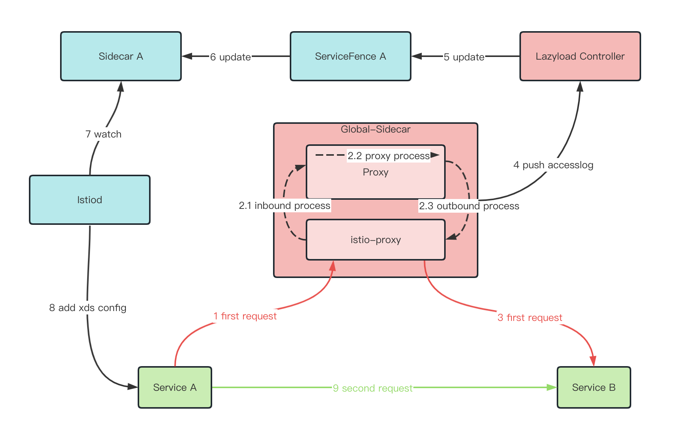

## 1.背景

服务网格在落地过程中存在一个问题：服务数量过多，导致xds推送量过大，从而影响整个网格性能。

为了优化这个问题，Istio社区推出了Sidecar资源，通过Sidecar资源，可以控制服务可见范围，减少xds推送量。

但是，Sidecar资源的手动创建，对于服务数量过多的场景，是一个很大的工作量。

lazyload模块的核心能力就是：替服务自动生成对应的Istio Sidecar资源，控制服务可见范围，减少xds推送量。

## 2. http懒加载

如果我们能够知道服务需要访问哪些其他服务，那么我们就可以将这些服务写入Sidecar资源中，从而控制服务可见范围。

**现在的难点在于：如何知道服务需要访问哪些其他服务？**

一个简单的方法：在服务上线前，通过人工的方式来确定服务需要访问哪些其他服务，但是这个工作量是巨大的。

所以，我们需要一个自动化的方案来解决这个问题，以下是lazyload懒加载的整体方案架构





1. Service A发起访问Service B，由于Service A没有Service B的配置信息，请求发到global-sidecar的sidecar

2. global-sidecar处理

   2.1 入流量拦截，如果是accesslog模式，sidecar会生成包含服务调用关系的accesslog

   2.2 global-sidecar应用根据请求头等信息，转换访问目标为Service B

   2.3 出流量拦截，sidecar拥有所有服务配置信息，找到Service B目标信息，发出请求

3. 请求正确到达Service B

4. global-sidecar通过accesslog方式上报调用关系Service A->Service B

5. lazyload controller获取到调用关系,更新ServiceFence A，添加关于B的metric

6. 更新Sidecar A的egress.hosts添加B信息

7. Istiod从ApiServer获取Sidecar A新内容

8. Istiod下发Sidecar A限定范围内的配置给Service A的sidecar，新增了B的xDS内容

9. 后续调用，Service A直接访问Service B成功

该方案主要依赖下面几个特性的实现：

### 2.1 生成默认的Sidecar资源

在部署Slime后，我们会默认给kubernetes service生成相应的Sidecar资源，该Sidecar资源的配置如下：

```yaml
apiVersion: networking.istio.io/v1beta1
kind: Sidecar
metadata:
  name: details
  namespace: default
spec:
  egress:
  - hosts:
    - istio-system/*
    - mesh-operator/*
  workloadSelector:
    labels:
      app: details
```

通过以上配置，details将只能访问istio-system和mesh-operator下的服务，这样在部署Slime后，xds的推送量就会极大减少。

### 2.2 兜底路由替换

我们通过envoyfilter将兜底路由allow_any替换成global-sidecar。

该过程由autoport特性自动完成，无需用户干预。

实际操作为：将allow_any remove，并新增一个指向 outbound|80||global-sidecar.mesh-operator.svc.cluster.local 的allow_all

这样那些由于Sidecar限制而没有路由信息的服务，就可以通过兜底至global-sidecar来访问。

```yaml
  - applyTo: VIRTUAL_HOST
    match:
      context: SIDECAR_OUTBOUND
      routeConfiguration:
        name: "80"
        vhost:
          name: allow_any
    patch:
      operation: REMOVE
  - applyTo: ROUTE_CONFIGURATION
    match:
      context: SIDECAR_OUTBOUND
      routeConfiguration:
        name: "80"
    patch:
      operation: MERGE
      value:
        virtual_hosts:
        - domains:
          - '*'
          name: allow_all
          routes:
          - match:
              prefix: /
            request_headers_to_add:
            - append: false
              header:
                key: Slime-Orig-Dest
                value: '%DOWNSTREAM_LOCAL_ADDRESS%'
            - append: false
              header:
                key: Slime-Source-Ns
                value: '%ENVIRONMENT(POD_NAMESPACE)%'
            route:
              cluster: outbound|80||global-sidecar.mesh-operator.svc.cluster.local  ## global-sidecar
              timeout: 0s
```

### 2.3 global-sidecar流量转发和accesslog上报

引入一个新组件 `global-sidecar`，负责流量转发和accesslog上报。

它会被集群内的Istiod注入标准的sidecar容器，形成global-sidecar+sidecar两个容器共同运行的模式。

sidecar容器的作用同一般的sidecar容器一样，连接Istiod，获取全量xds配置。

global-sidecar容器的作用是：负责流量转发。

**之所以采用这种模式，我们不希望在转发时丢失部分出方向的治理功能**

global-sidecar的工作逻辑如下：

- 首次访问的流量被兜底至global-sidecar，global-sidecar会将流量进行出方向治理并发送至目标服务。

- 同时sidecar将产生inbound和outbound两条accesslog。

**accsslog是一个非常重要的数据，我们可以通过accesslog来分析服务之间的调用关系**

lazyload将指定global-sidecar的accesslog上报至lazyload-accesslog-source(lazyload)

```yaml
apiVersion: networking.istio.io/v1alpha3
kind: EnvoyFilter
metadata:
  name: global-sidecar-accesslog
  namespace: mesh-operator
  ownerReferences:
  - apiVersion: config.netease.com/v1alpha1
    blockOwnerDeletion: true
    controller: true
    kind: SlimeBoot
    name: lazyload
spec:
  configPatches:
  - applyTo: NETWORK_FILTER
    match:
      listener:
        filterChain:
          filter:
            name: envoy.http_connection_manager
    patch:
      operation: MERGE
      value:
        typed_config:
          '@type': type.googleapis.com/envoy.extensions.filters.network.http_connection_manager.v3.HttpConnectionManager
          access_log:
          - name: envoy.access_loggers.http_grpc
            typed_config:
              '@type': type.googleapis.com/envoy.extensions.access_loggers.grpc.v3.HttpGrpcAccessLogConfig
              common_config:
                grpc_service:
                  envoy_grpc:
                    cluster_name: lazyload-accesslog-source ## slime
                log_name: http_envoy_accesslog
                transport_api_version: V3
  workloadSelector:
    labels:
      app: global-sidecar

---

apiVersion: v1
data:
  custom_bootstrap.json: |
    {
      "static_resources": {
        "clusters": [{
          "name": "lazyload-accesslog-source",
          "type": "STRICT_DNS",
          "connect_timeout": "5s",
          "http2_protocol_options": {},
          "dns_lookup_family": "V4_ONLY",
          "load_assignment": {
            "cluster_name": "lazyload-accesslog-source",
            "endpoints": [{
              "lb_endpoints": [{
                "endpoint": {
                  "address": {
                    "socket_address": {
                      "address": "lazyload.mesh-operator",
                      "port_value": 8082
                    }
                  }
                }
              }]
            }]
          },
          "respect_dns_ttl": true
        }]
      }
    }
kind: ConfigMap
```

### 2.4 lazyload分析accesslog,生成sidecar资源

global-sidecar产生的accesslog会被上报至lazyload, 对于每一条accesslog，lazyload会分析出服务之间的调用关系，并生成对应的sidecar资源。

这里过程比较复杂，我们只说明部分关键点。

* 只处理inbound方向的的accesslog，因为inbound的accesslog中已包含请求调用方和目标服务的信息

* 根据accesslog的sourceIp获取kubernetes service，作为请求调用方

* 从authority中获取信息作为目标服务

* 根据调用方和目标方信息，生成servicenference资源

* lazyload实际reconcile的对象是servicenference，根据servicenference生成sidecar资源

* sidecar资源一旦生成，流量就会直接转发至目标服务，不再经过global-sidecar


## 小结

以上就是http懒加载的整体流程，但还有很多细节没有说明，比如：

* 部署lazyload后，怎么生成默认的sidecar资源，请参考自动懒加载特性文档

* 兜底envoyfilter是如何生成的，请参考autoport特性文档

* 对于短域名问题，globla-sidecar是如何解决的，请参考短域名特性文档

* 对于htt2/grpc流量的懒加载，该如何实现，请参考grpc懒加载特性文档

