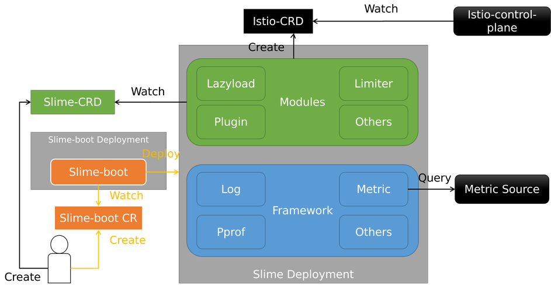

- [定位](#定位)
- [架构](#架构)
- [部署模型](#部署模型)
  - [单独部署](#单独部署)
  - [聚合部署](#聚合部署)
- [编译构建](#编译构建)
- [基础能力](#基础能力)
  - [纳管能力](#纳管能力)
  - [高可用](#高可用)
  - [对接configSource](#对接configsource)
  - [日志rotate](#日志rotate)
  - [pathRedirect](#pathredirect)
  - [标签透传](#标签透传)
  - [连接不同api-server](#连接不同api-server)


## 定位
Slime 定位是服务网格智能管理器，构建在服务网格之上。Slime 专注于以无侵入、智能化方式扩展并增强服务网格的核心功能（流量治理、安全性、可观测性）、性能、稳定性与运维性。Slime 简化业务接入与使用服务网格，并在生产环境大规模稳定运行服务网格提供管理保障。此外，Slime 通过精心设计的扩展机制，使业务不需要对服务网格基础框架进行修改，即可为服务网格赋予智能化使用与运维能力。

## 架构

Slime架构主要分为三大块：

1. slime-boot，部署Slime（slime-modules和slime-framework）的Operator组件。
2. slime-modules，Slime的核心线程，感知SlimeCRD并转换为IstioCRD，并触发内置的其他逻辑。
3. slime-framework，作为底座，为modules提供通用的基础能力。

其架构图如下：



Slime支持聚合打包，可以将任意模块聚合成一个镜像。所以，Slime可以以一个Deployment形式部署，避免组件过多。

## 部署模型

Slime通过slime-boot部署模块，目前支持单独部署和聚合部署两种形式

### 单独部署

每个模块单独部署, 具体可以参考SlimeBoot CR [单独部署lazyload](./slime-boot.md#lazyload安装样例)、[单独部署limiter](./slime-boot.md#limiter安装样例)、[单独部署plugin](./slime-boot.md#plugin安装样例)

### 聚合部署

聚合部署任意组件，下面是聚合了所有组件SlimeBoot CR样例，[聚合部署bundle](./slime-boot.md#bundle模式安装样例)

## 编译构建

上面两种部署模型，都需要在下发的SlimeBoot CR中指定镜像，用户可以使用样例中的镜像，也可以自行编译构建镜像，编译构建过程可参考[编译构建](./slime-build.md)

## 基础能力

### 纳管能力

在slime framework层面，目前存在以下几个`rev`, 使用者需要区分其使用场景

- isitoRev和strictRev

  isitoRev只作为纳管范围的语义, 配合strictRev(是否开启严格匹配)，决定需要对哪些资源的变动进行 reconcile

- configRev

  configRev决定从mcp over xds协议获取带有某些标签的资源

- selfResourceRev

  selfResourceRev 决定slime自身生成的资源的istio.io/rev的值，目前涉及的只有servicefence资源，即如果设置了selfResourceRev，那么生成的servicefence会带有该标签

在以下样例中，我们设置了 `sitoRev: istio-a,istio-b`, `strictRev: false`

其含义是：开启非严格纳管，如果smartlimiter上带有 `istio.io/rev:istio-a` 或者 `istio.io/rev:istio-a` 或者没有`istio.io/rev`标签，那么都会被limiter模块watch处理，如果带有 `istio.io/rev:istio-c`则不会被limiter模块watch处理。

```yaml
apiVersion: config.netease.com/v1alpha1
kind: SlimeBoot
metadata:
  name: limiter
  namespace: mesh-operator
spec:
  replicaCount: 2
  image:
    pullPolicy: Always
    repository: docker.io/slimeio/slime-limiter
    tag: v0.5.0_linux_amd64
  module:
    - name: limiter
      kind: limiter
      enable: true
      general:
        disableGlobalRateLimit: true
        disableAdaptive: true
        disableInsertGlobalRateLimit: true
      global:
        isitoRev: istio-112-a,istio-112-b
        strictRev: false
        log:
          logLevel: info
        configSources:
          - address: ss://
        misc: ## 在该字段下
          enable-leader-election: "on"
```

### 高可用

在最近代码更新（v0.5.0之后，不包含v0.5.0），slime支持了多副本运行，如果用户需要运行多副本，需要在SlimeBoot CR中指定`enable-leader-election`和`replicaCount`, 以单独部署limiter组件为例（tag需替换）

note: 目前framework支持了多副本能力，但只有limiter更新了镜像，全部镜像的更新会在v0.6.0

```yaml
apiVersion: config.netease.com/v1alpha1
kind: SlimeBoot
metadata:
  name: limiter
  namespace: mesh-operator
spec:
  replicaCount: 2
  image:
    pullPolicy: Always
    repository: docker.io/slimeio/slime-limiter
    tag: 1125_linux_amd64
  module:
    - name: limiter
      kind: limiter
      enable: true
      general:
        disableGlobalRateLimit: true
        disableAdaptive: true
        disableInsertGlobalRateLimit: true
      global:
        log:
          logLevel: info
        configSources:
          - address: ss://
        misc: ## 在该字段下
          enable-leader-election: "on"
```

### 对接configSource

slime除了支持从k8s source获取配置外，还可以从configSource获取配置信息，目前limiter模块可以通过configSource获取外部serviceEntry，其他模块也可以通过该特性获取配置信息(TODO)

使用方式：在global.configSources指定xds address和xdsSourceEnableIncPush

```yaml
apiVersion: config.netease.com/v1alpha1
kind: SlimeBoot
metadata:
  name: limiter
  namespace: mesh-operator
spec:
  image:
    pullPolicy: Always
    repository: docker.io/slimeio/slime-limiter
    tag: v0.5.0_linux_amd64
  module:
    - name: limiter
      kind: limiter
      enable: true
      general:
        disableGlobalRateLimit: true
        disableAdaptive: true
        disableInsertGlobalRateLimit: true
      global:
        log:
          logLevel: info
        configSources:
          - address: xds://istiod.istio-system.svc:16010
        ##以增量的形式推送
        xdsSourceEnableIncPush: true
```

### 日志rotate

除了通过`global.log.logLevel`设置日志等级外，slime还支持日志rotate，使用样例如下：

```yaml
apiVersion: config.netease.com/v1alpha1
kind: SlimeBoot
metadata:
  name: limiter
  namespace: mesh-operator
spec:
  image:
    pullPolicy: Always
    repository: docker.io/slimeio/slime-limiter
    tag: v0.5.0_linux_amd64
  module:
    - name: limiter
      kind: limiter
      enable: true
      general:
        disableGlobalRateLimit: true
        disableAdaptive: true
        disableInsertGlobalRateLimit: true
      global:
        log:
          logLevel: info
          logRotate: true
          logRotateConfig:
            filePath: 'xx'
            maxSizeMB: 100
            maxBackups: 3
            maxAgeDay:  10
        configSources:
          - address: ss://
```

### pathRedirect

该功能适用以下场景：一些模块不属于slime，但是后续发展过程中融入到了slime社区，并通过bundle模式将其功能与slime功能聚合成一个模块。

为了适配旧的模块，slime支持了pathRedirect，使用方式如下：

配置global.misc.pathRedirect，将所有对/xdsCache请求，redirect到/meshregistry/xdsCache

```yaml
apiVersion: config.netease.com/v1alpha1
kind: SlimeBoot
metadata:
  name: bundle
  namespace: mesh-operator
spec:
  image:
    pullPolicy: Always
    repository: docker.io/slimeio/slime-bundle-example-all
    tag: v0.5.0_linux_amd64
    module:
    - bundle:
        modules:
          - name: limiter
            kind: limiter
          - name: xx
            kind: xx
      enable: true
      global:
        misc:
          pathRedirect: >-
            /xdsCache->/meshregistry/xdsCache
      name: bundle
```
### 标签透传

默认行为，不需要开启

如果smartlimiter/envoyplugin/pluginmanager带有`istio.io/rev`标签，该标签会透传至其生成的envoyfilter

### 连接不同api-server

除了利用 in-cluster连接集群内api-server，slime还支持指定 masterUrl连接不同的api-server(需要对方不开启鉴权)

```yaml
apiVersion: config.netease.com/v1alpha1
kind: SlimeBoot
metadata:
  name: limiter
  namespace: mesh-operator
spec:
  image:
    pullPolicy: Always
    repository: docker.io/slimeio/slime-limiter
    tag: v0.5.0_linux_amd64
  module:
    - name: limiter
      kind: limiter
      enable: true
      general:
        disableGlobalRateLimit: true
        disableAdaptive: true
        disableInsertGlobalRateLimit: true
      global:
        masterUrl: 'xxx'
        log:
          logLevel: info
        configSources:
          - address: ss://
```
