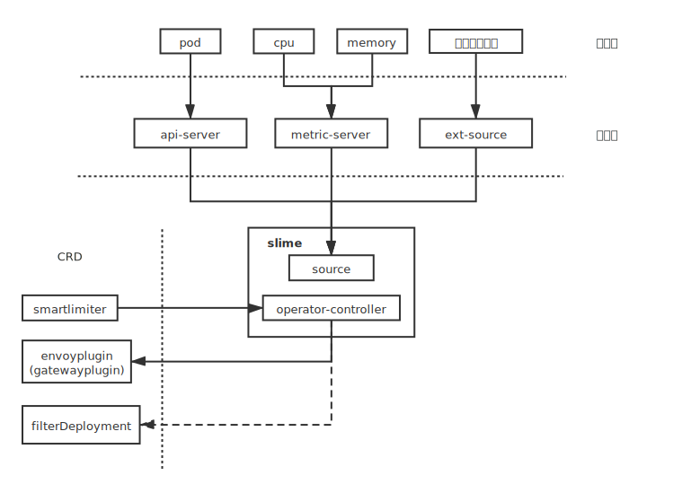
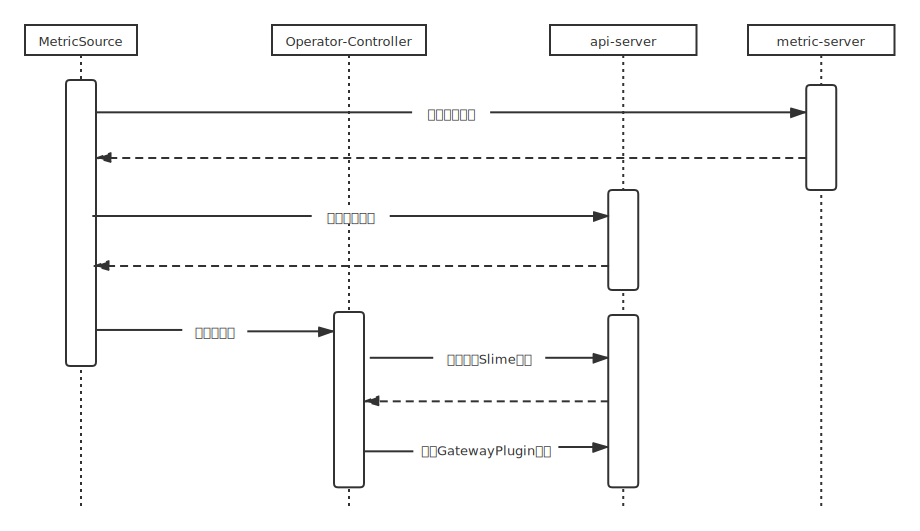

## 自适应限流组件（Slime）

### 1. 背景

在互联网应用中，流量洪峰是常有的事情。在应对流量洪峰时，通用的处理模式一般有排队、限流，这样可以非常直接有效的保护系统，防止系统被打爆。另外，通过限流技术手段，可以让整个系统的运行更加平稳。[^1]传统微服务架构通常采用限流`SDK`来编写微服务的限流器，例如`Netflix`的`hystrix`，阿里的`sentinel`。引入istio服务网格后，可以通过envoy中的限流插件实现限流，但是社区的限流方案需要结合目前已经处于废弃边缘的`mixer`组件，对于业务方来说是一个艰难的抉择。轻舟团队为了解决这一痛点，将社区依赖mixer的全局限流方案改变为单机限流。

单机限流插件解决了业务方对限流的基本需求，但是与传统架构中的限流`SDK`相比单机限流的配置较为简单。

```protobuf
message RateConfig {
    UnitType unit = 1;
    uint32 requests_per_unit = 2;
}

message RateLimitDescriptorConfigStatus {
    string key = 1;
    string value = 2;
    RateConfig rate_limit = 3;
    repeated RateLimitDescriptorConfigStatus descriptors = 4;
}
```

社区中较为成熟的限流`SDK`可以使用一些监控指标作为自适应流控策略，例如`Sentinel` 是可以通过负载，CPU使用率，总体平均RT等维度的监控指标，提前预判出流量洪峰的来临。自适应限流在时效性和准确性上都要优于手动限流。

为了实现网格场景下的自适应限流，我们在轻舟`ServiceMesh`之上加入一层自适应限流的封装，我们称之为`Smartlimiter`，同时通过`operator`组件`Slime`将其转换为轻舟`ServiceMesh`的插件`CRD`。

### 2. Slime用法介绍

`Slime`对上层暴露的`CRD`为`Smartlimiter`，其结构定义如下：

```protobuf
message SmartLimiterSpec {
    envoy.config.filter.http.local_flow_control.v2.FlowControlConfSpec ratelimitConfig = 1;
}
message FlowControlConfSpec {
    RateLimitConfSpec rate_limit_conf = 1;
}
message RateLimitConfSpec {
    string domain = 1;
    repeated RateLimitDescriptorConfigSpec descriptors = 2;
}
message RateLimitDescriptorConfigSpec {
    string key = 1;
    string value = 2;

    repeated RateLimitDescriptorConfigSpec descriptors = 4;
    string when = 6;  # 限流触发条件
    string then = 7;  # 限流触发时的配置
    UnitType unit = 8;
}
```

上层在配置`Smartlimiter`时需要为其指定限流触发条件的表达式，以及计算达到条件后的限流配置的表达式。表达式中可以使用`{监控项}`作为语料，目前支持的监控项有：

```
    cpu: 该服务中CPU消耗之和
    cpu_max: 该服务中CPU占用最大的容器
    memory: 该服务容器消耗内存之和
    memory_max: 该服务中内存占用最大的容器
    pod: 该服务的副本数量
```

例如，想要实现当`cpu`使用率大于`30000ns`时触发限流，限流额为100除以pod数量，可以如下配置：

```yaml
apiVersion: microservice.slime.io/v1alpha1
kind: SmartLimiter
metadata:
  name: a
  namespace: powerful
spec:
  ratelimitConfig:
    rate_limit_conf:
      descriptors:
      - key: header_match
        then: "100/{pod}"
        unit: 2
        value: Service[a.powerful-v13]-User[none]-Gateway[null]-Api[null]-Id[hash:-1026867156]
        when: "{cpu}>300000"

```

配置完成后，监控项会显示在`endPointStatus`中，限流信息显示在`ratelimitStatus`中，如下所示：

```yaml
apiVersion: microservice.slime.io/v1alpha1
kind: SmartLimiter
metadata:
  name: a
  namespace: powerful
spec:
  ratelimitConfig:
    rate_limit_conf:
      descriptors:
      - key: header_match
        then: "100/{pod}"
        unit: 2
        value: Service[a.powerful-v13]-User[none]-Gateway[null]-Api[null]-Id[hash:-1026867156]
        when: "{cpu}>300000"
status:
  endPointStatus:
    cpu: "398293"        # 业务容器和sidecar容器占用CPU之和 
    cpu_max: "286793"    # CPU占用最大的容器
    memory: "68022"      # 业务容器和sidecar容器内存占用之和  
    memory_max: "55236"  # 内存占用最大的容器
    pod: "1"
  ratelimitStatus:
    rate_limit_conf:
      descriptors:
      - key: header_match
        rate_limit:
          requests_per_unit: 9
          unit: 2
        value: Service[a.powerful-v13]-User[none]-Gateway[null]-Api[null]-Id[hash:-1026867156]
      domain: domain
```


### 3. 技术架构

slime在架构上分为监控采集模块和负责处理CRD的operator-controller。



监控采集模块负责从监控源采样所需的监控项。目前支持从`k8s-api-server`获取`pod`数量以及从`k8s-metric-server`获取`cpu`和`memory`的相关数据。当监测到监控项发生改变时会推送事件给`operator-controller`，触发其更新`envoyplugin（gatewayplugin）`。



当新的`slime crd`被添加/删除时，会触发`Operator-Controller`调用`MetricSource`的`WatchAdd/WatchRemove`更改


#### 引用

[1]  [限流组件](<https://www.cnblogs.com/Leo_wl/p/9062558.html>)