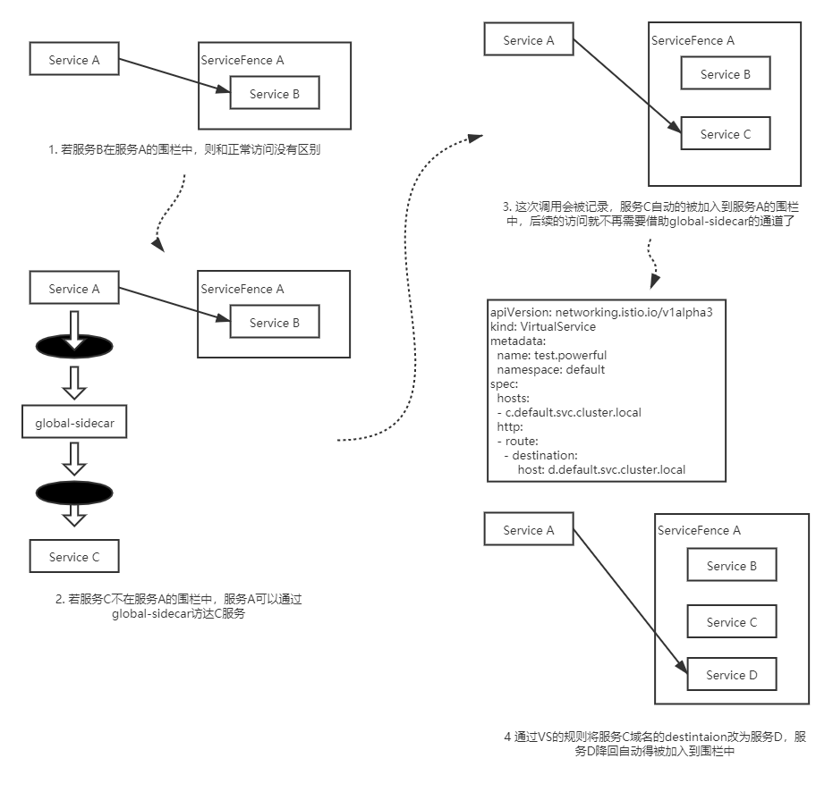

- [Lazyload Overview](#lazyload-overview)
  - [Features](#features)
  - [Backgroud](#backgroud)
  - [Thinking](#thinking)
  - [Architecture](#architecture)
  - [Install & Use](#install--use)
  - [Introduction of features](#introduction-of-features)
  - [Example](#example)
  - [E2E Test Introduction](#e2e-test-introduction)
  - [ServiceFence Instruction](#servicefence-instruction)
  - [FAQ](#faq)

# Lazyload Overview

## NOTE: en document is out of date

[中文](./README_zh.md)

## Features

1. Supports 1.8+ versions of Istio, without invasiveness, details at [recommended versions of istio](https://github.com/slime-io/slime/issues/145)
2. all namespaces in mesh can use Lazyload
3. Forwarding process supports all Istio traffic capabilities
4. Independent of the number of services, no performance issues
5. Support for enabling lazyload for services manually or automatically
6. Support for dynamic service dependency acquisition methods such as Accesslog and Prometheus
7. Support for adding static service dependencies, a combination of dynamic and static dependencies, comprehensive functionality

## Backgroud

When there are too many services in cluster, envoy configuration is too much, and the new application will be in NotReady state for a long time. Configuring Custom Resource `Sidecar` for new application and automatically fetching the service dependencies and updating Sidecar can solve this problem.

## Thinking

Introduce a service `global-sidecar`, which is used for request last matching. It will be injected sidecar container by Istiod. with a full configuration and service discovery information. The pass through route is replaced with a new one to the global-sidecar.

Bring new Custom Resource `ServiceFence`. Details at [ServiceFence Instruction](#ServiceFence-Instruction)

Finally, the control logic is included in the lazyload controller component. It will create ServiceFence and Sidecar for the lazyload enabled services, and update ServiceFence and Sidecar based on the service invocation relationship obtained from the configuration.

## Architecture

The module consists of a Lazyload controller, which does not need to inject a sidecar, and a global-sidecar, which does.

Details at [Architecture](./lazyload_tutorials.md#Architecture)

## Install & Use

- Depending on the deployment mode of global-sidecar, the module is currently divided into two modes.
  - Clusrter mode: Using global-sidecar at the cluster level: the only global-sidecar application in the cluster

  - Namespace mode: global-sidecar at namespace level: one global-sidecar application per namespace using lazyload
2. Depending on the source of the service dependency metrics, the module is divided into two modes.

   - Accesslog mode: global-sidecar generates an accesslog with service dependencies through incoming traffic interception
   - Prometheus mode: the business application generates a metric after completing an access, which is reported to prometheus; this mode requires the cluster to interface with prometheus

In summary, there are four usage modes for the Lazyload module, with the cluster+accesslog mode being the most recommended.

Details at [Install&Use](./lazyload_tutorials.md#install-and-use)

## Introduction of features
- Support for using lazyload based on accesslog
- Support for enabling lazyload for services manually or automatically
- Custom undefined traffic dispatch
- Support for adding static service dependencies
- Support for custom service dependency aliases
- Log output to local file and rotate

Details at [Introduction of features](./lazyload_tutorials.md#Introduction-of-features)

## Example

Details at [Example](./lazyload_tutorials.md#Example)

## E2E Test Introduction

When developmenting, the module function can be verified correctly through E2E testing.

Details at [E2E Test Tutorials](https://github.com/slime-io/slime/blob/master/doc/en/slime_e2e_test.md)

## ServiceFence Instruction

ServiceFence can be seen as a Sidecar resource for a service. The difference is that ServiceFence not only generates Sidecar resources based on dependencies, but also determines the real backend of the service based on VirtualService rules and automatically expands the scope of Fence.

For example, c.default.svc.cluster.local is in servicefence. Now a route has a host of c.default.svc.cluster.local, the destination chagnes to d.default.svc.cluster.local. Then service d will be included in servicefence.

## FAQ

详见 [FAQ](./lazyload_tutorials.md#FAQ)
