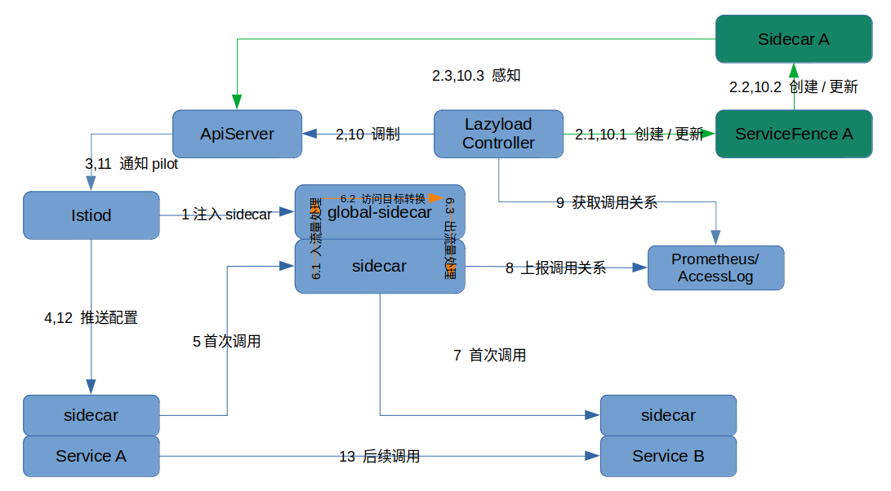

- [懒加载概述](#懒加载概述)
  - [特点](#特点)
  - [背景](#背景)
  - [思路](#思路)
  - [架构](#架构)
  - [安装和使用](#安装和使用)
  - [更多信息](#更多信息)

# 懒加载概述

[English](./README.md)

## 特点

1. 场景丰富：支持动态和静态管理 `Sidecar` 资源
2. 治理完善：支持 Istio 所有流量治理能力
3. 对 Istio 友好：无侵入性，支持1.8以上的 Istio
4. 使用简单：可自动对接整个服务网格

## 背景

懒加载即按需加载。

没有懒加载时，服务网格内服务数量过多时，Envoy 配置量太大，新上的应用长时间处于 Not Ready 状态。为应用配置 Custom Resource `Sidecar`，并自动的获取服务依赖关系，管理 `Sidecar` 可以解决此问题。但是社区的 `Sidecar` 资源没有自动管理的手段。

其次，在按需配置的场景下，应用必然面对第一次访问新的目标服务缺少相关 xds 配置的问题，需要解决。

## 思路

首先解决 `Sidecar` 资源的自动管理问题。

我们引入了新的 CRD `ServiceFence`， 来辅助管理  `Sidecar` 资源。我们可以在 `ServiceFence` 中存储服务的静态、动态依赖关系，从而管理相应的 `Sidecar` 资源。 `lazyload controller` 组件是控制器。它会为启用懒加载的服务创建 `ServiceFence` 和 `Sidecar`，根据配置获取到服务调用关系，更新 `ServiceFence` 和 `Sidecar` 。

其次，解决首次访问的兜底问题。

我们引入了一个组件 `global-sidecar`，来负责流量兜底。它会被集群的 Istiod 注入标准的 sidecar 容器，因此拥有全量的配置和服务信息。然后，通过 `EnvoyFilter` 将兜底路由替换为指向 `global-sidecar` ，实现对请求的兜底和正确转发。

## 架构

整个模块由 `lazyload controller` 和 `global-sidecar` 两部分组成。`lazyload controller` 无需注入 sidecar ，global-sidecar 则需要注入。

根据服务依赖关系指标来源的不同，分为两种模式：

- Accesslog 模式：`global-sidecar` 通生成包含服务依赖关系的 `accesslog` 作为指标
- Prometheus 模式：业务应用在完成访问后，生成 promtheus metric ，作为指标

推荐 Accesslog 模式。具体的细节说明可以参见[架构](./lazyload_tutorials_zh.md#%E6%9E%B6%E6%9E%84)

## 安装和使用

详见 [示例: 为bookinfo的productpage服务开启懒加载](./lazyload_tutorials_zh.md#%E7%A4%BA%E4%BE%8B)

## 更多信息

懒加载详细介绍参见 [懒加载教程](./lazyload_tutorials_zh.md)

