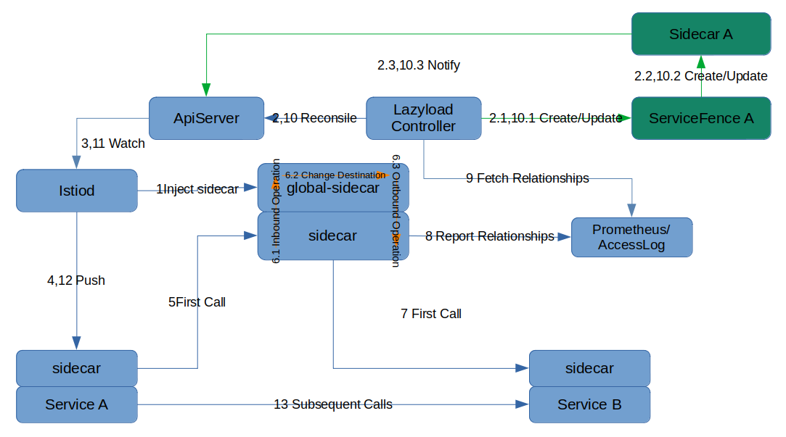

- [Lazyload Turotails](#lazyload-turotails)
  - [Architecture](#architecture)
  - [Installation and Usage](#installation-and-usage)
    - [Installing istio (1.8+)](#installing-istio-18)
    - [Installing slime-boot](#installing-slime-boot)
    - [安装 lazyload](#安装-lazyload)
    - [Install bookinfo](#install-bookinfo)
    - [Enable lazy loading](#enable-lazy-loading)
    - [First visit observation](#first-visit-observation)
    - [Visit again to observe](#visit-again-to-observe)
    - [卸载](#卸载)
  - [Feature introduction](#feature-introduction)
    - [Automatic service port nano-management](#automatic-service-port-nano-management)
    - [Enable lazy loading based on Accesslog](#enable-lazy-loading-based-on-accesslog)
    - [Manually or automatically enable lazy loading for services](#manually-or-automatically-enable-lazy-loading-for-services)
      - [Auto Mode](#auto-mode)
      - [Manual mode](#manual-mode)
    - [Custom underride traffic assignment](#custom-underride-traffic-assignment)
    - [Adding Static Service Dependencies](#adding-static-service-dependencies)
      - [Dependency on a service](#dependency-on-a-service)
      - [Dependency on all services in a namespace](#dependency-on-all-services-in-a-namespace)
      - [Dependency on all services with  label](#dependency-on-all-services-with--label)
    - [Customizing service dependency aliases](#customizing-service-dependency-aliases)
    - [Log output to local and rotate](#log-output-to-local-and-rotate)
      - [Creating a storage volume](#creating-a-storage-volume)
      - [Declare mount information in SlimeBoot](#declare-mount-information-in-slimeboot)


# Lazyload Turotails

## Architecture



* The green arrows are the internal logic of lazyload controller, and the orange arrows are the internal logic of global-sidecar. 

Instruction：

1. Deploy the Lazyload module, and Istiod will inject the standard sidecar (envoy) for the global-sidecar application

2. Enable lazyload for Service A

   2.1 Create ServiceFence A

   2.2 Create Sidecar(Istio CRD) A, and initialize accrording to the static config of ServiceFence.spec

   2.3 ApiServer senses sidecar A creation

3. Istiod gets the content of Sidecar A

4. Istiod pushed new configuration to sidecar of Service A

5. Service A sends first request to Service B. sidecar A does not has information about Service B, then request is sent to global-sidecar.

6. Global-sidecar operations

   6.1 Inbound traffic is intercepted, and in accesslog mode, sidecar generates an accesslog containing the service invocation relationship

   6.2 The global-sidecar application converts the access target to Service B based on the request header and other information

   6.3 Outbound traffic interception, where sidecar has all the service configuration information, finds the Service B target information and sends the request

7. Request sends to Service B

8. Global-sidecar reports relationships through access log or prometheus metric

9. Lazyload controller gets the relationships

10. lazyload controller updates lazyload configuration

    10.1 Update ServiceFence A adding infomation about Service B

    10.2 Update Sidecar A，adding egress.hosts of Service B

    10.3 ApiServer senses Sidecar A update

11. Istiod gets the content of Sidecar A

12. Istiod pushed new configuration to sidecar of Service A

13. Service A sends request to Service B directly


## Installation and Usage

This tutorial demonstrates enabling lazyloading for bookinfo's productpage service.

### Installing istio (1.8+)

Install istio by itself.


### Installing slime-boot

Before installing lazy loading, you need to install `SlimeBoot CRD`, `ServiceFence CRD` and `deployment/slime-boot`. 

This step is to prepare the CRD needed for lazy loading and the launcher for the lazy loading module. 

The installation files are slightly different for different k8s versions, see [SlimeBoot Introduction and Use - Preparation](../../../../../../doc/en/slime-boot.md#Preparation)

- k8s version >= v1.22
```shell
export tag_or_commit=$(curl -s https://api.github.com/repos/slime-io/slime/tags | grep 'name' | cut -d\" -f4 | head -1)
kubectl create ns mesh-operator
kubectl apply -f "https://raw.githubusercontent.com/slime-io/slime/$tag_or_commit/install/init/crds-v1.yaml"
kubectl apply -f "https://raw.githubusercontent.com/slime-io/slime/$tag_or_commit/install/init/deployment_slime-boot.yaml"
```

- k8s v1.16 <= version < 1.22
```shell
export tag_or_commit=$(curl -s https://api.github.com/repos/slime-io/slime/tags | grep 'name' | cut -d\" -f4 | head -1)
kubectl create ns mesh-operator
kubectl apply -f "https://raw.githubusercontent.com/slime-io/slime/$tag_or_commit/install/init/crds.yaml"
kubectl apply -f "https://raw.githubusercontent.com/slime-io/slime/$tag_or_commit/install/init/deployment_slime-boot.yaml"
```

verify that all components are operational

```sh
$ kubectl get pod -n mesh-operator
NAME                              READY   STATUS    RESTARTS   AGE
slime-boot-6f778b75cd-4v675       1/1     Running   0          26s
```


### 安装 lazyload

apply `SlimeBoot`

```sh
$ echo '
apiVersion: config.netease.com/v1alpha1
kind: SlimeBoot
metadata:
  name: lazyload
  namespace: mesh-operator
spec:
  image:
    pullPolicy: Always
    repository: docker.io/slimeio/slime-lazyload
    tag: v0.7.1
  namespace: mesh-operator
  istioNamespace: istio-system
  module:
    - name: lazyload
      kind: lazyload
      enable: true
      general:
        autoPort: true
        autoFence: true
        defaultFence: true
        wormholePort: # replace to your application service ports, and extend the list in case of multi ports
          - "9080"
      global:
        log:
          logLevel: info
        misc:
          globalSidecarMode: cluster # the mode of global-sidecar
          metricSourceType: accesslog # indicate the metric source
        slimeNamespace: mesh-operator
  resources:
    requests:
      cpu: 300m
      memory: 300Mi
    limits:
      cpu: 600m
      memory: 600Mi        
  component:
    globalSidecar:
      enable: true
      sidecarInject:
        enable: true # should be true
        mode: pod
        labels: # optional, used for sidecarInject.mode = pod
          sidecar.istio.io/inject: "true"
      resources:
        requests:
          cpu: 200m
          memory: 200Mi
        limits:
          cpu: 400m
          memory: 400Mi
      image:
        repository: docker.io/slimeio/slime-global-sidecar
        tag: v0.7.1
      probePort: 20000
' > /tmp/lazyload-slimeboot.yaml

$ kubectl apply -f /tmp/lazyload-slimeboot.yaml
```

refer to [lazyload](../../../../../../doc/en/slime-boot.md#sample-lazyload-installation)


verify that all components are operational

```sh
$ kubectl get slimeboot -n mesh-operator
NAME       AGE
lazyload   12s
$ kubectl get pod -n mesh-operator
NAME                              READY   STATUS    RESTARTS   AGE
global-sidecar-7dd48b65c8-gc7g4   2/2     Running   0          18s
lazyload-85987bbd4b-djshs         1/1     Running   0          18s
slime-boot-6f778b75cd-4v675       1/1     Running   0          126s
```


### Install bookinfo

Before creating it, please switch the namespace in current-context to the namespace where you want to deploy bookinfo, so that bookinfo is created in it. Here we use default as an example.

```sh
$ kubectl label namespace default istio-injection=enabled
$ kubectl apply -f "https://raw.githubusercontent.com/slime-io/slime/v0.5.0/install/config/bookinfo.yaml"
```

after creation, the status is as follows

```sh
$ kubectl get po -n default
NAME                              READY   STATUS    RESTARTS   AGE
details-v1-79f774bdb9-6vzj6       2/2     Running   0          60s
productpage-v1-6b746f74dc-vkfr7   2/2     Running   0          59s
ratings-v1-b6994bb9-klg48         2/2     Running   0          59s
reviews-v1-545db77b95-z5ql9       2/2     Running   0          59s
reviews-v2-7bf8c9648f-xcvd6       2/2     Running   0          60s
reviews-v3-84779c7bbc-gb52x       2/2     Running   0          60s
```


### Enable lazy loading

Modify the service's label to automatically create servicefence and enable lazy loading for the productpage service

```sh
$ kubectl label service productpage -n default slime.io/serviceFenced=true
```


confirm the generation of servicefence and sidecar objects.

```sh
$ kubectl get servicefence -n default
NAME          AGE
productpage   12s
$ kubectl get sidecar -n default
NAME          AGE
productpage   22s
$ kubectl get servicefence productpage -n default -oyaml
apiVersion: microservice.slime.io/v1alpha1
kind: ServiceFence
metadata:
  creationTimestamp: "2021-12-23T06:21:14Z"
  generation: 1
  labels:
    app.kubernetes.io/created-by: fence-controller
  name: productpage
  namespace: default
  resourceVersion: "10662886"
  uid: f21e7d2b-4ab3-4de0-9b3d-131b6143d9db
spec:
  enable: true
status: {}
$ kubectl get sidecar productpage -n default -oyaml
apiVersion: networking.istio.io/v1beta1
kind: Sidecar
metadata:
  creationTimestamp: "2021-12-23T06:21:14Z"
  generation: 1
  name: productpage
  namespace: default
  ownerReferences:
  - apiVersion: microservice.slime.io/v1alpha1
    blockOwnerDeletion: true
    controller: true
    kind: ServiceFence
    name: productpage
    uid: f21e7d2b-4ab3-4de0-9b3d-131b6143d9db
  resourceVersion: "10662887"
  uid: 85f9dc11-6d83-4b84-8d1b-14bd031cc57b
spec:
  egress:
  - hosts:
    - istio-system/*
    - mesh-operator/*
  workloadSelector:
    labels:
      app: productpage
```


### First visit observation

This sample can initiate access to the productpage in pod/ratings, `curl productpage:9080/productpage`.

first time, use `kubectl logs -f productpage-xxx -c istio-proxy -n default` to look for access log

```
[2021-12-23T06:24:55.527Z] "GET /details/0 HTTP/1.1" 200 - via_upstream - "-" 0 178 12 12 "-" "curl/7.52.1" "7ec25152-ca8e-923b-a736-49838ce316f4" "details:9080" "172.17.0.10:80" outbound|9080||global-sidecar.mesh-operator.svc.cluster.local 172.17.0.11:45194 10.102.66.227:9080 172.17.0.11:40210 - -

[2021-12-23T06:24:55.552Z] "GET /reviews/0 HTTP/1.1" 200 - via_upstream - "-" 0 295 30 29 "-" "curl/7.52.1" "7ec25152-ca8e-923b-a736-49838ce316f4" "reviews:9080" "172.17.0.10:80" outbound|9080||global-sidecar.mesh-operator.svc.cluster.local 172.17.0.11:45202 10.104.97.115:9080 172.17.0.11:40880 - -

[2021-12-23T06:24:55.490Z] "GET /productpage HTTP/1.1" 200 - via_upstream - "-" 0 4183 93 93 "-" "curl/7.52.1" "7ec25152-ca8e-923b-a736-49838ce316f4" "productpage:9080" "172.17.0.11:9080" inbound|9080|| 127.0.0.6:48621 172.17.0.11:9080 172.17.0.7:41458 outbound_.9080_._.productpage.default.svc.cluster.local default
```

It can be seen that this time the outbound backend accesses global-sidecar.mesh-operator.svc.cluster.local.

look for servicefence

```sh
$ kubectl get servicefence productpage -n default -oyaml
apiVersion: microservice.slime.io/v1alpha1
kind: ServiceFence
metadata:
  creationTimestamp: "2021-12-23T06:21:14Z"
  generation: 1
  labels:
    app.kubernetes.io/created-by: fence-controller
  name: productpage
  namespace: default
  resourceVersion: "10663136"
  uid: f21e7d2b-4ab3-4de0-9b3d-131b6143d9db
spec:
  enable: true
status:
  domains:
    details.default.svc.cluster.local:
      hosts:
      - details.default.svc.cluster.local
    reviews.default.svc.cluster.local:
      hosts:
      - reviews.default.svc.cluster.local
  metricStatus:
    '{destination_service="details.default.svc.cluster.local"}': "1"
    '{destination_service="reviews.default.svc.cluster.local"}': "1"
```


look for sidecar

```sh
$ kubectl get sidecar productpage -n default -oyaml
apiVersion: networking.istio.io/v1beta1
kind: Sidecar
metadata:
  creationTimestamp: "2021-12-23T06:21:14Z"
  generation: 2
  name: productpage
  namespace: default
  ownerReferences:
  - apiVersion: microservice.slime.io/v1alpha1
    blockOwnerDeletion: true
    controller: true
    kind: ServiceFence
    name: productpage
    uid: f21e7d2b-4ab3-4de0-9b3d-131b6143d9db
  resourceVersion: "10663141"
  uid: 85f9dc11-6d83-4b84-8d1b-14bd031cc57b
spec:
  egress:
  - hosts:
    - '*/details.default.svc.cluster.local'
    - '*/reviews.default.svc.cluster.local'
    - istio-system/*
    - mesh-operator/*
  workloadSelector:
    labels:
      app: productpage
```

reviews and details are automatically added!


### Visit again to observe

Visit the productpage for the second time and observe the productpage application log

```
[2021-12-23T06:26:47.700Z] "GET /details/0 HTTP/1.1" 200 - via_upstream - "-" 0 178 13 12 "-" "curl/7.52.1" "899e918c-e44c-9dc2-9629-d8db191af972" "details:9080" "172.17.0.13:9080" outbound|9080||details.default.svc.cluster.local 172.17.0.11:50020 10.102.66.227:9080 172.17.0.11:42180 - default

[2021-12-23T06:26:47.718Z] "GET /reviews/0 HTTP/1.1" 200 - via_upstream - "-" 0 375 78 77 "-" "curl/7.52.1" "899e918c-e44c-9dc2-9629-d8db191af972" "reviews:9080" "172.17.0.16:9080" outbound|9080||reviews.default.svc.cluster.local 172.17.0.11:58986 10.104.97.115:9080 172.17.0.11:42846 - default

[2021-12-23T06:26:47.690Z] "GET /productpage HTTP/1.1" 200 - via_upstream - "-" 0 5179 122 121 "-" "curl/7.52.1" "899e918c-e44c-9dc2-9629-d8db191af972" "productpage:9080" "172.17.0.11:9080" inbound|9080|| 127.0.0.6:51799 172.17.0.11:9080 172.17.0.7:41458 outbound_.9080_._.productpage.default.svc.cluster.local default
```

You can see that the backend access information of the outbound log changes to details.default.svc.cluster.local and reviews.default.svc.cluster.local, and the direct access is successful.


### 卸载

uninstall bookinfo

```sh
$ kubectl delete -f "https://raw.githubusercontent.com/slime-io/slime/v0.5.0/install/config/bookinfo.yaml"
```

uninstall lazyload

```sh
$ kubectl delete -f /tmp/lazyload-slimeboot.yaml
```

uninstall slime-boot

```sh
export tag_or_commit=$(curl -s https://api.github.com/repos/slime-io/slime/tags | grep 'name' | cut -d\" -f4 | head -1)
kubectl delete -f "https://raw.githubusercontent.com/slime-io/slime/$tag_or_commit/install/init/deployment_slime-boot.yaml"
kubectl delete -f "https://raw.githubusercontent.com/slime-io/slime/$tag_or_commit/install/init/crds-v1.yaml"
kubectl delete ns mesh-operator
```


## Feature introduction

### Automatic service port nano-management

Lazy loading supports automatically listening to service port information in the cluster and enabling lazy loading for all ports, so that there is no need to manually specify a list of service ports.

The lazy loading module configuration parameter `general.autoPort` is a switch equal to true to enable automatic port management, equal to false or unspecified to manage it manually. Compatible with previous versions, ports manually specified in `general.wormholePort` will also be lazy loaded. For security reasons, port ** will only be automatically increased** when auto-napping. If you need to reduce the range of ports, switch to manual mode, or restart lazy loading in automatic mode. Lazy loading follows Istio's logic for port protocols (port names starting with "HTTP, HTTP2, GRPC, GRPCWeb") and only senses port changes for HTTP protocols.

```yaml
kind: SlimeBoot
metadata:
  name: lazyload
  namespace: mesh-operator
spec:
  # ...
  module:
    - name: lazyload
      kind: lazyload
      enable: true
      general:
        autoPort: true
      global:
        misc:
          globalSidecarMode: cluster # inform the mode of global-sidecar
          metricSourceType: accesslog # indicate the metric source
 # ...
```


### Enable lazy loading based on Accesslog

Specifying that the SlimeBoot CR resource `spec.module.global.misc.metricSourceType` is equal to `accesslog` will use Accesslog to get the service call relationship, and equal to `prometheus` will use Prometheus.

The approximate process of using Accesslog to get the service call relationship.

- slime-boot finds `metricSourceType: accesslog` when creating the global-sidecar and generates an additional configmap with static_resources containing the address information of the lazyload controller processing accesslog. The static_resources is then added to the global-sidecar configuration via an envoyfilter, so that the global-sidecar accesslog is sent to the lazyload 
- The global-sidecar generates an accesslog when it completes its under-the-hood forwarding, containing information about the caller and the called service. global-sidecar sends the information to the lazyload controller 
- The lazyload controller analyzes the accesslog and obtains the new service call relationship 

The subsequent process of modifying the servicefence and sidecar is the same as that for the prometheus metric. 

sample

```yaml
spec:
  module:
    - name: lazyload # custom value
      kind: lazyload # should be "lazyload"
      enable: true
      general: # replace previous "fence" field
        wormholePort: # replace to your application svc ports
          - "9080"
      global:
        misc:
          metricSourceType: accesslog
```


### Manually or automatically enable lazy loading for services

It is supported to specify whether enabling lazy loading is in manual mode, automatic mode via the `autoFence` parameter. Here, enabling lazy loading means creating serviceFence resources to generate Sidecar CR.

Support `defaultFence` parameter to specify whether to enable lazy loading globally in automatic mode.

The configuration is as follows


```yaml
---
apiVersion: config.netease.com/v1alpha1
kind: SlimeBoot
metadata:
  name: lazyload
  namespace: mesh-operator
spec:
  module:
    - name: lazyload
      kind: lazyload
      enable: true
      general:
        autoFence: true # true为自动模式，false为手动模式，默认为手动模式
        defaultFence: true # 自动模式下默认行为，true为创建servicefence，false为不创建，默认不创建
  # ...
```


#### Auto Mode

Auto mode is entered when the `autoFence` parameter is `true`. The range of services enabled for lazy loading in automatic mode is adjusted by three dimensions.

Service level - label `slime.io/serviceFenced`

* `false`: not automatically enabled
* `true`: Automatically enabled

* Other values or default: Use Namespace level configuration

Namespace level - label `slime.io/serviceFenced`

* `false`: all services under this namespace are not automatically enabled
* `true`: All services under this namespace are automatically enabled
* Other values or default: use global level configuration

Global level - lazyload's `defaultFence` parameter

- `false`: global not automatically enabled
- `true`: global auto-enable

Priority: Service level > Namespace level > Global level


Note: For automatically generated ServiceFence resources, they are recorded by the standard Label `app.kubernetes.io/created-by=fence-controller`, which enables the state association change. ServiceFence resources that do not match this Label are considered to be manually configured and are not affected by the above Label.


**Example**

> There are three services under Namespace `testns`: `svc1`, `svc2`, `svc3`

* When `autoFence` is `true` and `defaultFence` is `true`, the ServiceFence for the above three services is generated automatically
* Add Label `slime.io/serviceFenced: "false"` to Namespace testns, all ServiceFences disappear.
* Label `svc1` with `slime.io/serviceFenced: "true"` label: ServiceFence for service `svc1` is created
* Delete the label on Namespace and Service: Restore the three ServiceFences


**sample**

```yaml
apiVersion: v1
kind: Namespace
metadata:
  labels:
    istio-injection: enabled
    slime.io/serviceFenced: "false"
  name: testns
---
apiVersion: v1
kind: Service
metadata:
  annotations: {}
  labels:
    app: svc1
    service: svc1
    slime.io/serviceFenced: "true"
  name: svc1
  namespace: testns
```


#### Manual mode

When the `autoFence` parameter is `false`, lazy loading is enabled for manual mode, requiring the user to manually create ServiceFence resources. This enablement is Service level.


### Custom underride traffic assignment

By default, lazyload/fence sends traffic that envoy cannot match the route (default) to the global sidecar to deal with the problem of missing data for transient services, which is inevitably faced by "lazy loading". This solution is limited by technical details, and cannot handle traffic whose target (e.g. domain name) is outside the cluster properly, see [[Configuration Lazy Loading]: Failed to access external service #3](https://github.com/slime-io/slime/issues/3).

Based on this background, this feature was designed to be used in more flexible business scenarios as well. The general idea is to assign different default traffic to different targets for correct processing by means of domain matching.


配置样例：

```yaml
module:
  - name: lazyload
    kind: lazyload
    enable: true
    general:
      wormholePort:
      - "80"
      - "8080"
      dispatches:  # new field
      - name: 163
        domains:
        - "www.163.com"
        cluster: "outbound|80||egress1.testns.svc.cluster.local"  # standard istio cluster format: <direction>|<svcPort>|<subset>|<svcFullName>, normally direction is outbound and subset is empty      
      - name: baidu
        domains:
        - "*.baidu.com"
        - "baidu.*"
        cluster: "{{ (print .Values.foo \".\" .Values.namespace ) }}"  # you can use template to construct cluster dynamically
      - name: sohu
        domains:
        - "*.sohu.com"
        - "sodu.*"
        cluster: "_GLOBAL_SIDECAR"  # a special name which will be replaced with actual global sidecar cluster
      - name: default
        domains:
        - "*"
        cluster: "PassthroughCluster"  # a special istio cluster which will passthrough the traffic according to orgDest info. It's the default behavior of native istio.
```

> In this example, we assign a portion of the traffic to the specified cluster; let it go to the global sidecar; and then for the rest of the traffic, let it keep the native istio behavior: passthrough


**Note**.

**Custom assignment scenario, if you want to keep the original logic "all other undefined traffic goes to global sidecar", you need to explicitly configure the penultimate clause as above


### Adding Static Service Dependencies

Lazy loading supports adding static service dependencies via `serviceFence.spec` in addition to updating service dependencies from slime metric based on dynamic metrics. Three breakdown scenarios are supported: dependency on a service, dependency on all services in a namespace, and dependency on all services with a label.


#### Dependency on a service

For scenarios where a lazy-load enabled service is statically dependent on one or more other services, the configuration can be added directly to the sidecar crd at initialization time.

The following example adds a static dependency on the `reviews.default` service for a lazy-load enabled service.

```yaml
# servicefence
spec:
  enable: true
  host:
    reviews.default.svc.cluster.local: # static dependenct of reviews.default service
      stable:

# related sidecar
spec:
  egress:
  - hosts:
    - '*/reviews.default.svc.cluster.local'
    - istio-system/*
    - mesh-operator/*
```


#### Dependency on all services in a namespace

For scenarios where a lazy-load enabled service statically depends on all services in one or more other namespaces, the configuration can be added directly to the sidecar crd at initialization time.

In the following example, a static dependency on all services in the `test` namespace is added for the lazy-load enabled service.

```yaml
# servicefence
spec:
  enable: true
  host:
    test/*: {} # static dependency of all services in test namespace

# related sidecar
spec:
  egress:
  - hosts:
    - test/*
    - istio-system/*
    - mesh-operator/*
```


#### Dependency on all services with  label

For scenarios where a lazy-load enabled service statically depends on all services with a label or multiple labels, the configuration can be added directly to the sidecar crd at initialization time.

The following example adds static dependencies for all services with `app=details` and all services with `app=reviews, group=default` to the lazy-load enabled service.
```yaml
# servicefence
spec:
  enable: true
  labelSelector: # Match service label, multiple selectors are 'or' relationship
    - selector:
        app: details
    - selector: # labels in one selector are 'and' relationship
        app: reviews
        group: default

# related sidecar
spec:
  egress:
  - hosts:
    - '*/details.default.svc.cluster.local' # with label "app=details"
    - '*/details.test.svc.cluster.local' # with label "app=details"
    - '*/reviews.default.svc.cluster.local' # with label "app=details" and "group=default"
    - istio-system/*
    - mesh-operator/*
```


### Customizing service dependency aliases

In some scenarios, we want to lazy load to add some additional service dependencies in based on known service dependencies.

Users can provide custom conversion relationships to achieve the requirement by configuring `general.domainAliases`. `general.domainAliases` contains multiple `domainAlias`, each `domainAlias` consists of a matching rule `pattern` and a transformation rule `templates`. `pattern` contains only one matching rule, while `templates` can contain multiple conversion rules.

For example, we want to add `<svc>. <ns>.svc.cluster.local` with the additional `<ns>. <svc>.mailsaas` service dependency, you can configure it like this

```yaml
apiVersion: config.netease.com/v1alpha1
kind: SlimeBoot
metadata:
  name: lazyload
  namespace: mesh-operator
spec:
  module:
    - name: lazyload-test
      kind: lazyload
      enable: true
      general:
        wormholePort: # replace to your application service ports, and extend the list in case of multi ports
          - "9080"
        domainAliases: 
          - pattern: '(?P<service>[^\.]+)\.(?P<namespace>[^\.]+)\.svc\.cluster\.local$'
            templates:
              - "$namespace.$service.mailsaas"
  #...
```

and servicefence is like:

```yaml
apiVersion: microservice.slime.io/v1alpha1
kind: ServiceFence
metadata:
  name: ratings
  namespace: default
spec:
  enable: true
  host:
    details.default.svc.cluster.local: # static dependent service
      stable: {}
status:
  domains:
    default.details.mailsaas: # static dependent service converted result
      hosts:
      - default.details.mailsaas
    default.productpage.mailsaas: # dynamic dependent service converted result
      hosts:
      - default.productpage.mailsaas
    details.default.svc.cluster.local:
      hosts:
      - details.default.svc.cluster.local
    productpage.default.svc.cluster.local:
      hosts:
      - productpage.default.svc.cluster.local
  metricStatus:
    '{destination_service="productpage.default.svc.cluster.local"}': "1" # dynamic dependent service
```

sidecar like:

```yaml
apiVersion: networking.istio.io/v1beta1
kind: Sidecar
metadata:
  name: ratings
  namespace: default
spec:
  egress:
  - hosts:
    - '*/default.details.mailsaas' # static dependent service converted result
    - '*/default.productpage.mailsaas' # dynamic dependent service converted result
    - '*/details.default.svc.cluster.local'
    - '*/productpage.default.svc.cluster.local'
    - istio-system/*
    - mesh-operator/*
  workloadSelector:
    labels:
      app: ratings
```


### Log output to local and rotate

Slime's logs are output to the standard output by default. Specifying `spec.module.global.log.logRotate` equal to `true` in the SlimeBoot CR resource will output the logs locally and start the log rotation, and no longer output to the standard output.

The rotation configuration is also adjustable, and the default configuration is as follows, which can be overridden by displaying the individual values in the specified logRotateConfig.

```yaml
spec:
  module:
    - name: lazyload # custom value
      kind: lazyload # should be "lazyload"
      enable: true
      general: # replace previous "fence" field
        wormholePort: # replace to your application svc ports
          - "9080"
      global:
        log:
          logRotate: true
          logRotateConfig:
            filePath: "/tmp/log/slime.log"
            maxSizeMB: 100
            maxBackups: 10
            maxAgeDay: 10
            compress: true
```

It is usually required to be used with storage volumes. After the storage volume is prepared, specify `spec.volumes` and `spec.containers.slime.volumeMounts` in the SlimeBoot CR resource to show the path where the storage volume will be mounted to the log local file.

Here is the full demo based on the minikube kubernetes scenario

#### Creating a storage volume

Create a storage volume of type hostpath based on the /mnt/data path

```yaml
# hostPath pv for minikube demo
---
apiVersion: v1
kind: PersistentVolumeClaim
metadata:
  name: lazyload-claim
  namespace: mesh-operator
spec:
  storageClassName: manual
  accessModes:
    - ReadWriteOnce
  resources:
    requests:
      storage: 3Gi
---
apiVersion: v1
kind: PersistentVolume
metadata:
  name: lazyload-volumn
  labels:
    type: local
spec:
  storageClassName: manual
  capacity:
    storage: 5Gi
  accessModes:
    - ReadWriteOnce
  hostPath:
    path: "/mnt/data"
```

#### Declare mount information in SlimeBoot

Specify in the SlimeBoot CR resource that the storage volume will be mounted to the "/tmp/log" path of the pod, so that slime logs will be persisted to the /mnt/data path and will be rotated automatically.

```yaml
---
apiVersion: config.netease.com/v1alpha1
kind: SlimeBoot
metadata:
  name: lazyload
  namespace: mesh-operator
spec:
  image:
    pullPolicy: Always
    repository: docker.io/slimeio/slime-lazyload
    tag: master-e5f2d83-dirty_1b68486
  module:
    - name: lazyload # custom value
      kind: lazyload # should be "lazyload"
      enable: true
      general: # replace previous "fence" field
        wormholePort:
          - "9080"
      global:
        log:
          logRotate: true
          logRotateConfig:
            filePath: "/tmp/log/slime.log"
            maxSizeMB: 100
            maxBackups: 10
            maxAgeDay: 10
            compress: true
#...
  volumes:
    - name: lazyload-storage
      persistentVolumeClaim:
        claimName: lazyload-claim
  containers:
    slime:
      volumeMounts:
        - mountPath: "/tmp/log"
          name: lazyload-storage
```

[sample](./install/samples/lazyload/slimeboot_logrotate.yaml)

