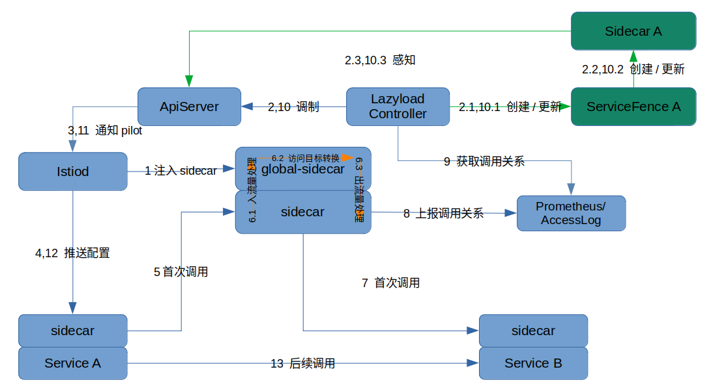

- [懒加载教程](#懒加载教程)
  - [架构](#架构)
  - [安装和使用](#安装和使用)
    - [安装 istio (1.8+)](#安装-istio-18)
    - [安装 slime-boot](#安装-slime-boot)
    - [安装 lazyload](#安装-lazyload)
    - [安装bookinfo](#安装bookinfo)
    - [开启懒加载](#开启懒加载)
    - [首次访问观察](#首次访问观察)
    - [再次访问观察](#再次访问观察)
    - [卸载](#卸载)
  - [特性介绍](#特性介绍)
    - [服务端口自动纳管](#服务端口自动纳管)
    - [基于Accesslog开启懒加载](#基于accesslog开启懒加载)
    - [手动或自动为服务启用懒加载](#手动或自动为服务启用懒加载)
      - [自动模式](#自动模式)
      - [手动模式](#手动模式)
    - [自定义兜底流量分派](#自定义兜底流量分派)
    - [添加静态服务依赖关系](#添加静态服务依赖关系)
      - [依赖某个服务](#依赖某个服务)
      - [依赖某个namespace所有服务](#依赖某个namespace所有服务)
      - [依赖具有某个label的所有服务](#依赖具有某个label的所有服务)
    - [自定义服务依赖别名](#自定义服务依赖别名)
    - [日志输出到本地并轮转](#日志输出到本地并轮转)
      - [创建存储卷](#创建存储卷)
      - [在SlimeBoot中声明挂载信息](#在slimeboot中声明挂载信息)


# 懒加载教程

## 架构

服务网格中的所有namespace都可以使用懒加载，无需显式指定使用懒加载的命令空间列表。

使用懒加载需要部署一个global-sidecar应用，位于lazyload controller的namespace下，默认为mesh-operator。所有兜底请求都会发到这个global-sidecar应用。




注：绿色箭头为lazyload controller内部逻辑，黄色箭头为global-sidecar内部逻辑。

过程说明：

1. 部署Lazyload模块，自动创建global-sidecar应用，Istiod会为global-sidecar应用添加标准sidecar（envoy）

2. 为服务A启用懒加载

   2.1 创建ServiceFence A

   2.2 创建Sidecar（Istio CRD）A，根据静态配置（ServiceFence.spec）初始化

   2.3 ApiServer感知到Sidecar A创建

3. Istiod从ApiServer获取Sidecar A的内容

4. Istiod下发Sidecar A限定范围内的配置给Service A的sidecar

5. Service A发起访问Service B，由于Service A没有Service B的配置信息，请求发到global-sidecar的sidecar

6. global-sidecar处理

   6.1 入流量拦截，如果是accesslog模式，sidecar会生成包含服务调用关系的accesslog

   6.2 global-sidecar应用根据请求头等信息，转换访问目标为Service B

   6.3 出流量拦截，sidecar拥有所有服务配置信息，找到Service B目标信息，发出请求

7. 请求正确到达Service B

8. global-sidecar通过accesslog方式上报调用关系Service A->Service B，如果是prometheus模式，则由应用方的sidecar生成、上报metric

9. lazyload controller获取到调用关系

10. lazyload更新懒加载配置

    10.1 更新ServiceFence A，添加关于B的metric

    10.2 更新Sidecar A，egress.hosts添加B信息

    10.3 ApiServer 感知到Sidecar A更新

11. Istiod从ApiServer获取Sidecar A新内容

12. Istiod下发Sidecar A限定范围内的配置给Service A的sidecar，新增了B的xDS内容

13. 后续调用，Service A直接访问Service B成功


## 安装和使用

本教程演示为bookinfo的productpage服务开启懒加载。

### 安装 istio (1.8+)

自行安装好 istio 。


### 安装 slime-boot

安装懒加载前，需要先安装 `SlimeBoot CRD`， `ServiceFence CRD`和`deployment/slime-boot`。这一步是为了准备好懒加载需要的 CRD 以及懒加载模块的启动器。不同 k8s 版本的安装文件略有区别，详见 [SlimeBoot 介绍与使用 - 准备](../../../../../../doc/zh/slime-boot.md#%E5%87%86%E5%A4%87) 。

- k8s version >= v1.22
```shell
export tag_or_commit=$(curl -s https://api.github.com/repos/slime-io/slime/tags | grep 'name' | cut -d\" -f4 | head -1)
kubectl create ns mesh-operator
kubectl apply -f "https://raw.githubusercontent.com/slime-io/slime/$tag_or_commit/install/init/crds-v1.yaml"
kubectl apply -f "https://raw.githubusercontent.com/slime-io/slime/$tag_or_commit/install/init/deployment_slime-boot.yaml"
```

- k8s v1.16 <= version < 1.22
```shell
export tag_or_commit=$(curl -s https://api.github.com/repos/slime-io/slime/tags | grep 'name' | cut -d\" -f4 | head -1)
kubectl create ns mesh-operator
kubectl apply -f "https://raw.githubusercontent.com/slime-io/slime/$tag_or_commit/install/init/crds.yaml"
kubectl apply -f "https://raw.githubusercontent.com/slime-io/slime/$tag_or_commit/install/init/deployment_slime-boot.yaml"
```

确认所有组件已正常运行

```sh
$ kubectl get pod -n mesh-operator
NAME                              READY   STATUS    RESTARTS   AGE
slime-boot-6f778b75cd-4v675       1/1     Running   0          26s
```


### 安装 lazyload

创建 `SlimeBoot` CR

```sh
$ echo '
apiVersion: config.netease.com/v1alpha1
kind: SlimeBoot
metadata:
  name: lazyload
  namespace: mesh-operator
spec:
  image:
    pullPolicy: Always
    repository: docker.io/slimeio/slime-lazyload
    tag: v0.7.1
  namespace: mesh-operator
  istioNamespace: istio-system
  module:
    - name: lazyload
      kind: lazyload
      enable: true
      general:
        autoPort: true
        autoFence: true
        defaultFence: true
        wormholePort: # replace to your application service ports, and extend the list in case of multi ports
          - "9080"
      global:
        log:
          logLevel: info
        misc:
          globalSidecarMode: cluster # the mode of global-sidecar
          metricSourceType: accesslog # indicate the metric source
        slimeNamespace: mesh-operator
  resources:
    requests:
      cpu: 300m
      memory: 300Mi
    limits:
      cpu: 600m
      memory: 600Mi        
  component:
    globalSidecar:
      enable: true
      sidecarInject:
        enable: true # should be true
        mode: pod
        labels: # optional, used for sidecarInject.mode = pod
          sidecar.istio.io/inject: "true"
      resources:
        requests:
          cpu: 200m
          memory: 200Mi
        limits:
          cpu: 400m
          memory: 400Mi
      image:
        repository: docker.io/slimeio/slime-global-sidecar
        tag: v0.7.1
      probePort: 20000
' > /tmp/lazyload-slimeboot.yaml

kubectl apply -f /tmp/lazyload-slimeboot.yaml
```

一些字段说明，可参考 [lazyload安装样例](../../../../../../doc/zh/slime-boot.md#lazyload%E5%AE%89%E8%A3%85%E6%A0%B7%E4%BE%8B)


确认所有组件已正常运行

```sh
$ kubectl get slimeboot -n mesh-operator
NAME       AGE
lazyload   12s
$ kubectl get pod -n mesh-operator
NAME                              READY   STATUS    RESTARTS   AGE
global-sidecar-7dd48b65c8-gc7g4   2/2     Running   0          18s
lazyload-85987bbd4b-djshs         1/1     Running   0          18s
slime-boot-6f778b75cd-4v675       1/1     Running   0          126s
```


### 安装bookinfo

   创建前请将current-context中namespace切换到你想部署bookinfo的namespace，使bookinfo创建在其中。此处以default为例。

```sh
$ kubectl label namespace default istio-injection=enabled
$ kubectl apply -f "https://raw.githubusercontent.com/slime-io/slime/v0.5.0/install/config/bookinfo.yaml"
```

创建完后，状态如下

```sh
$ kubectl get po -n default
NAME                              READY   STATUS    RESTARTS   AGE
details-v1-79f774bdb9-6vzj6       2/2     Running   0          60s
productpage-v1-6b746f74dc-vkfr7   2/2     Running   0          59s
ratings-v1-b6994bb9-klg48         2/2     Running   0          59s
reviews-v1-545db77b95-z5ql9       2/2     Running   0          59s
reviews-v2-7bf8c9648f-xcvd6       2/2     Running   0          60s
reviews-v3-84779c7bbc-gb52x       2/2     Running   0          60s
```


### 开启懒加载

由于我们在下发的slimeboot中指定了以下配置，所以默认情况下自动开启了懒加载

```
  autoPort: true
  autoFence: true
  defaultFence: true
```

如果`defaultFence: false`, 那么需要用户手动在service上加上`slime.io/serviceFenced="true"`开启服务懒加载

```
  autoPort: true
  autoFence: true
  defaultFence: false
```

```
kubectl label service productpage -n default slime.io/serviceFenced=true
```

确认生成servicefence和sidecar对象。

```sh
$ kubectl get servicefence -n default
NAME          AGE
productpage   12s
$ kubectl get sidecar -n default
NAME          AGE
productpage   22s
$ kubectl get servicefence productpage -n default -oyaml
apiVersion: microservice.slime.io/v1alpha1
kind: ServiceFence
metadata:
  creationTimestamp: "2021-12-23T06:21:14Z"
  generation: 1
  labels:
    app.kubernetes.io/created-by: fence-controller
  name: productpage
  namespace: default
  resourceVersion: "10662886"
  uid: f21e7d2b-4ab3-4de0-9b3d-131b6143d9db
spec:
  enable: true
status: {}
$ kubectl get sidecar productpage -n default -oyaml
apiVersion: networking.istio.io/v1beta1
kind: Sidecar
metadata:
  creationTimestamp: "2021-12-23T06:21:14Z"
  generation: 1
  name: productpage
  namespace: default
  ownerReferences:
  - apiVersion: microservice.slime.io/v1alpha1
    blockOwnerDeletion: true
    controller: true
    kind: ServiceFence
    name: productpage
    uid: f21e7d2b-4ab3-4de0-9b3d-131b6143d9db
  resourceVersion: "10662887"
  uid: 85f9dc11-6d83-4b84-8d1b-14bd031cc57b
spec:
  egress:
  - hosts:
    - istio-system/*
    - mesh-operator/*
  workloadSelector:
    labels:
      app: productpage
```


### 首次访问观察

此样例中可以在pod/ratings中发起对productpage的访问，`curl productpage:9080/productpage`。

另外也可参考 [对外开放应用程序](https://istio.io/latest/zh/docs/setup/getting-started/#ip) 给应用暴露外访接口。


第一次访问productpage，并使用`kubectl logs -f productpage-xxx -c istio-proxy -n default`观察访问日志。

```
[2021-12-23T06:24:55.527Z] "GET /details/0 HTTP/1.1" 200 - via_upstream - "-" 0 178 12 12 "-" "curl/7.52.1" "7ec25152-ca8e-923b-a736-49838ce316f4" "details:9080" "172.17.0.10:80" outbound|9080||global-sidecar.mesh-operator.svc.cluster.local 172.17.0.11:45194 10.102.66.227:9080 172.17.0.11:40210 - -

[2021-12-23T06:24:55.552Z] "GET /reviews/0 HTTP/1.1" 200 - via_upstream - "-" 0 295 30 29 "-" "curl/7.52.1" "7ec25152-ca8e-923b-a736-49838ce316f4" "reviews:9080" "172.17.0.10:80" outbound|9080||global-sidecar.mesh-operator.svc.cluster.local 172.17.0.11:45202 10.104.97.115:9080 172.17.0.11:40880 - -

[2021-12-23T06:24:55.490Z] "GET /productpage HTTP/1.1" 200 - via_upstream - "-" 0 4183 93 93 "-" "curl/7.52.1" "7ec25152-ca8e-923b-a736-49838ce316f4" "productpage:9080" "172.17.0.11:9080" inbound|9080|| 127.0.0.6:48621 172.17.0.11:9080 172.17.0.7:41458 outbound_.9080_._.productpage.default.svc.cluster.local default
```

可以看出，此次outbound后端访问global-sidecar.mesh-operator.svc.cluster.local。

观察servicefence

```sh
$ kubectl get servicefence productpage -n default -oyaml
apiVersion: microservice.slime.io/v1alpha1
kind: ServiceFence
metadata:
  creationTimestamp: "2021-12-23T06:21:14Z"
  generation: 1
  labels:
    app.kubernetes.io/created-by: fence-controller
  name: productpage
  namespace: default
  resourceVersion: "10663136"
  uid: f21e7d2b-4ab3-4de0-9b3d-131b6143d9db
spec:
  enable: true
status:
  domains:
    details.default.svc.cluster.local:
      hosts:
      - details.default.svc.cluster.local
    reviews.default.svc.cluster.local:
      hosts:
      - reviews.default.svc.cluster.local
  metricStatus:
    '{destination_service="details.default.svc.cluster.local"}': "1"
    '{destination_service="reviews.default.svc.cluster.local"}': "1"
```


观察sidecar

```sh
$ kubectl get sidecar productpage -n default -oyaml
apiVersion: networking.istio.io/v1beta1
kind: Sidecar
metadata:
  creationTimestamp: "2021-12-23T06:21:14Z"
  generation: 2
  name: productpage
  namespace: default
  ownerReferences:
  - apiVersion: microservice.slime.io/v1alpha1
    blockOwnerDeletion: true
    controller: true
    kind: ServiceFence
    name: productpage
    uid: f21e7d2b-4ab3-4de0-9b3d-131b6143d9db
  resourceVersion: "10663141"
  uid: 85f9dc11-6d83-4b84-8d1b-14bd031cc57b
spec:
  egress:
  - hosts:
    - '*/details.default.svc.cluster.local'
    - '*/reviews.default.svc.cluster.local'
    - istio-system/*
    - mesh-operator/*
  workloadSelector:
    labels:
      app: productpage
```

reviews 和 details 被自动加入！


### 再次访问观察

第二次访问productpage，观察productpage应用日志

```
[2021-12-23T06:26:47.700Z] "GET /details/0 HTTP/1.1" 200 - via_upstream - "-" 0 178 13 12 "-" "curl/7.52.1" "899e918c-e44c-9dc2-9629-d8db191af972" "details:9080" "172.17.0.13:9080" outbound|9080||details.default.svc.cluster.local 172.17.0.11:50020 10.102.66.227:9080 172.17.0.11:42180 - default

[2021-12-23T06:26:47.718Z] "GET /reviews/0 HTTP/1.1" 200 - via_upstream - "-" 0 375 78 77 "-" "curl/7.52.1" "899e918c-e44c-9dc2-9629-d8db191af972" "reviews:9080" "172.17.0.16:9080" outbound|9080||reviews.default.svc.cluster.local 172.17.0.11:58986 10.104.97.115:9080 172.17.0.11:42846 - default

[2021-12-23T06:26:47.690Z] "GET /productpage HTTP/1.1" 200 - via_upstream - "-" 0 5179 122 121 "-" "curl/7.52.1" "899e918c-e44c-9dc2-9629-d8db191af972" "productpage:9080" "172.17.0.11:9080" inbound|9080|| 127.0.0.6:51799 172.17.0.11:9080 172.17.0.7:41458 outbound_.9080_._.productpage.default.svc.cluster.local default
```

可以看到，outbound日志的后端访问信息变为details.default.svc.cluster.local和reviews.default.svc.cluster.local，直接访问成功。


### 卸载

卸载 bookinfo

```sh
$ kubectl delete -f "https://raw.githubusercontent.com/slime-io/slime/v0.5.0/install/config/bookinfo.yaml"
```

卸载 lazyload

```sh
kubectl delete -f /tmp/lazyload-slimeboot.yaml
kubectl delete envoyfilter to-global-sidecar -n istio-system
```

卸载 servicefence

```
for i in $(kubectl get ns --no-headers |awk '{print $1}');do kubectl delete servicefence -n $i --all;done
```

卸载 slime-boot

```sh
export tag_or_commit=$(curl -s https://api.github.com/repos/slime-io/slime/tags | grep 'name' | cut -d\" -f4 | head -1)
kubectl delete -f "https://raw.githubusercontent.com/slime-io/slime/$tag_or_commit/install/init/deployment_slime-boot.yaml"
kubectl delete -f "https://raw.githubusercontent.com/slime-io/slime/$tag_or_commit/install/init/crds-v1.yaml"
kubectl delete ns mesh-operator
```


## 特性介绍

### 服务端口自动纳管

懒加载支持自动监听集群内服务端口信息，并为所有端口启用懒加载，这样就无需手动指定服务端口列表。

懒加载模块配置参数`general.autoPort`是开关，等于true，启动端口自动纳管，等于false或者不指定，则手动管理。兼容之前版本，`general.wormholePort`中手动指定的端口也会被懒加载纳管。为了安全，自动纳管时，端口**只会自动增加**。如果需要缩减端口范围，切换到手动模式，或自动模式下重启懒加载。懒加载遵循Istio对端口协议的判断逻辑（端口名以“HTTP, HTTP2, GRPC, GRPCWeb”开头），只感知HTTP协议的端口变化。

样例：

```yaml
kind: SlimeBoot
metadata:
  name: lazyload
  namespace: mesh-operator
spec:
  # ...
  module:
    - name: lazyload
      kind: lazyload
      enable: true
      general:
        autoPort: true
      global:
        misc:
          globalSidecarMode: cluster # inform the mode of global-sidecar
          metricSourceType: accesslog # indicate the metric source
 # ...
```


### 基于Accesslog开启懒加载

指定SlimeBoot CR资源中`spec.module.global.misc.metricSourceType`等于`accesslog`会使用Accesslog获取服务调用关系，等于`prometheus`则使用Prometheus。

使用Accesslog获取服务调用关系的大概过程：

- slime-boot在创建global-sidecar时，发现`metricSourceType: accesslog`，额外生成一个configmap，内容是包含lazyload controller处理accesslog的地址信息的static_resources。再通过一个envoyfilter，将static_resources加入global-sidecar配置中，使得global-sidecar的accesslog会发送到lazyload controller
- global-sidecar完成兜底转发时会生成accesslog，包含了调用方和被调用方服务信息。global-sidecar将信息发送给lazyload controller
- lazyload controller分析accesslog，获取到新的服务调用关系

随后的过程，就是修改servicefence和sidecar，和处理prometheus metric的过程一致。

样例

```yaml
spec:
  module:
    - name: lazyload # custom value
      kind: lazyload # should be "lazyload"
      enable: true
      general: # replace previous "fence" field
        wormholePort: # replace to your application svc ports
          - "9080"
      global:
        misc:
          metricSourceType: accesslog
```


### 手动或自动为服务启用懒加载

支持通过`autoFence`参数，指定启用懒加载是手动模式、自动模式。这里的启用懒加载，指的是创建serviceFence资源，从而生成Sidecar CR。

支持通过`defaultFence`参数，指定自动模式下，是否全局启用懒加载。

配置方式如下

```yaml
---
apiVersion: config.netease.com/v1alpha1
kind: SlimeBoot
metadata:
  name: lazyload
  namespace: mesh-operator
spec:
  module:
    - name: lazyload
      kind: lazyload
      enable: true
      general:
        autoFence: true # true为自动模式，false为手动模式，默认为手动模式
        defaultFence: true # 自动模式下默认行为，true为创建servicefence，false为不创建，默认不创建
  # ...
```


#### 自动模式

当`autoFence`参数为`true`时，进入自动模式。自动模式下，启用懒加载的服务范围，通过三个维度调整。

Service级别 - label `slime.io/serviceFenced`

* `false`： 不自动启用
* `true`： 自动启用

* 其他值或缺省： 使用Namespace级别配置

Namespace级别 - label `slime.io/serviceFenced`

* `false`： 该namespace下的所有服务都不自动启用
* `true`：该namespace下的所有服务都自动启用
* 其他值或缺省： 使用全局级别配置

全局级别 - lazyload的`defaultFence`参数

- `false`： 全局不自动启用
- `true`：全局自动启用

优先级：Service级别 > Namespace级别 > 全局级别


注：对于自动生成的ServiceFence资源 ，会通过标准Label `app.kubernetes.io/created-by=fence-controller`来记录，实现了状态关联变更。 而不匹配该Label的ServiceFence资源，视为手动配置，不受以上Label影响。


**举例**

> Namespace `testns`下有三个服务： `svc1`, `svc2`, `svc3`

* 当`autoFence`为`true`且`defaultFence`为`true`时，自动生成以上三个服务的ServiceFence
* 给Namespace testns加上Label `slime.io/serviceFenced: "false"`， 所有ServiceFence消失
* 给`svc1`打上 `slime.io/serviceFenced: "true"` label： 服务`svc1`的ServiceFence创建
* 删掉Namespace和Service上的label：恢复三个ServiceFence


**配置样例**

```yaml
apiVersion: v1
kind: Namespace
metadata:
  labels:
    istio-injection: enabled
    slime.io/serviceFenced: "false"
  name: testns
---
apiVersion: v1
kind: Service
metadata:
  annotations: {}
  labels:
    app: svc1
    service: svc1
    slime.io/serviceFenced: "true"
  name: svc1
  namespace: testns
```


#### 手动模式

当`autoFence`参数为`false`时，启用懒加载为手动模式，需要用户手动创建ServiceFence资源。这种启用是Service级别的。


### 自定义兜底流量分派

lazyload/fence默认会将envoy无法匹配路由（缺省）的流量兜底发送到global sidecar，应对短暂服务数据缺失的问题，这是“懒加载”所必然面对的。 该方案因为技术细节上的局限性，对于目标（如域名）是集群外的流量，无法正常处理，详见 [[Configuration Lazy Loading]: Failed to access external service #3](https://github.com/slime-io/slime/issues/3)。

基于这个背景，设计了本特性，同时也能用于更灵活的业务场景。 大致思路是通过域名匹配的方式将不同的缺省流量分派到不同的目标做正确处理。


配置样例：

```yaml
module:
  - name: lazyload
    kind: lazyload
    enable: true
    general:
      wormholePort:
      - "80"
      - "8080"
      dispatches:  # new field
      - name: 163
        domains:
        - "www.163.com"
        cluster: "outbound|80||egress1.testns.svc.cluster.local"  # standard istio cluster format: <direction>|<svcPort>|<subset>|<svcFullName>, normally direction is outbound and subset is empty      
      - name: baidu
        domains:
        - "*.baidu.com"
        - "baidu.*"
        cluster: "{{ (print .Values.foo \".\" .Values.namespace ) }}"  # you can use template to construct cluster dynamically
      - name: sohu
        domains:
        - "*.sohu.com"
        - "sodu.*"
        cluster: "_GLOBAL_SIDECAR"  # a special name which will be replaced with actual global sidecar cluster
      - name: default
        domains:
        - "*"
        cluster: "PassthroughCluster"  # a special istio cluster which will passthrough the traffic according to orgDest info. It's the default behavior of native istio.
```

> 在本例中，我们把一部分流量分派给了指定的cluster； 另一部分让它走global sidecar； 然后对其余的流量，让它保持原生istio的行为： passthrough


**注意**：

* 自定义分派场景，如果希望保持原有逻辑 “其他所有未定义流量走global sidecar” 的话，需要显式配置如上的倒数第二条


### 添加静态服务依赖关系

懒加载除了从slime metric处根据动态指标更新服务依赖关系，还支持通过`serviceFence.spec`添加静态服务依赖关系。支持三种细分场景：依赖某个服务、依赖某个namespace所有服务、依赖具有某个label的所有服务。


#### 依赖某个服务

适用于启用懒加载的服务静态依赖另外一个或多个服务的场景，可以在初始化时直接将配置加入sidecar crd。

下面的样例中，为启用懒加载的服务添加对`reviews.default`服务的静态依赖关系。

```yaml
# servicefence
spec:
  enable: true
  host:
    reviews.default.svc.cluster.local: # static dependenct of reviews.default service
      stable:

# related sidecar
spec:
  egress:
  - hosts:
    - '*/reviews.default.svc.cluster.local'
    - istio-system/*
    - mesh-operator/*
```


#### 依赖某个namespace所有服务

适用于启用懒加载的服务静态依赖另外一个或多个namespace中所有服务的场景，可以在初始化时直接将配置加入sidecar crd。

下面的样例中，为启用懒加载的服务添加对`test`命名空间中所有服务的静态依赖关系。

```yaml
# servicefence
spec:
  enable: true
  host:
    test/*: {} # static dependency of all services in test namespace

# related sidecar
spec:
  egress:
  - hosts:
    - test/*
    - istio-system/*
    - mesh-operator/*
```


#### 依赖具有某个label的所有服务

适用于启用懒加载的服务静态依赖具有某个label或多个label的所有服务的场景，可以在初始化时直接将配置加入sidecar crd。

下面的样例中，为启用懒加载的服务添加拥有`app=details`的所有服务，以及拥有`app=reviews, group=default`的所有服务的静态依赖关系。

```yaml
# servicefence
spec:
  enable: true
  labelSelector: # Match service label, multiple selectors are 'or' relationship
    - selector:
        app: details
    - selector: # labels in one selector are 'and' relationship
        app: reviews
        group: default

# related sidecar
spec:
  egress:
  - hosts:
    - '*/details.default.svc.cluster.local' # with label "app=details"
    - '*/details.test.svc.cluster.local' # with label "app=details"
    - '*/reviews.default.svc.cluster.local' # with label "app=details" and "group=default"
    - istio-system/*
    - mesh-operator/*
```


### 自定义服务依赖别名

在某些场景，我们希望懒加载根据已知的服务依赖，添加一些额外的服务依赖进去。

用户可以通过配置`general.domainAliases`，提供自定义的转换关系，实现需求。`general.domainAliases`包含多个`domainAlias`，每个`domainAlias`由匹配规则`pattern`和转换规则`templates`组成。`pattern`只包含一个匹配规则，`templates`则可以包含多个转换规则。

举个例子，我们希望添加`<svc>.<ns>.svc.cluster.local`时，额外添加`<ns>.<svc>.mailsaas`的服务依赖，则可以这么配置

```yaml
apiVersion: config.netease.com/v1alpha1
kind: SlimeBoot
metadata:
  name: lazyload
  namespace: mesh-operator
spec:
  module:
    - name: lazyload-test
      kind: lazyload
      enable: true
      general:
        wormholePort: # replace to your application service ports, and extend the list in case of multi ports
          - "9080"
        domainAliases: 
          - pattern: '(?P<service>[^\.]+)\.(?P<namespace>[^\.]+)\.svc\.cluster\.local$'
            templates:
              - "$namespace.$service.mailsaas"
  #...
```

对应的servicefence会这样

```yaml
apiVersion: microservice.slime.io/v1alpha1
kind: ServiceFence
metadata:
  name: ratings
  namespace: default
spec:
  enable: true
  host:
    details.default.svc.cluster.local: # static dependent service
      stable: {}
status:
  domains:
    default.details.mailsaas: # static dependent service converted result
      hosts:
      - default.details.mailsaas
    default.productpage.mailsaas: # dynamic dependent service converted result
      hosts:
      - default.productpage.mailsaas
    details.default.svc.cluster.local:
      hosts:
      - details.default.svc.cluster.local
    productpage.default.svc.cluster.local:
      hosts:
      - productpage.default.svc.cluster.local
  metricStatus:
    '{destination_service="productpage.default.svc.cluster.local"}': "1" # dynamic dependent service
```

sidecar则是这样

```yaml
apiVersion: networking.istio.io/v1beta1
kind: Sidecar
metadata:
  name: ratings
  namespace: default
spec:
  egress:
  - hosts:
    - '*/default.details.mailsaas' # static dependent service converted result
    - '*/default.productpage.mailsaas' # dynamic dependent service converted result
    - '*/details.default.svc.cluster.local'
    - '*/productpage.default.svc.cluster.local'
    - istio-system/*
    - mesh-operator/*
  workloadSelector:
    labels:
      app: ratings
```


### 日志输出到本地并轮转

slime的日志默认输出到标准输出，指定SlimeBoot CR资源中`spec.module.global.log.logRotate`等于`true`会将日志输出到本地并启动日志轮转，不再输出到标准输出。

轮转配置也是可调整的，默认的配置如下，可以通过显示指定logRotateConfig中的各个值进行覆盖。

```yaml
spec:
  module:
    - name: lazyload # custom value
      kind: lazyload # should be "lazyload"
      enable: true
      general: # replace previous "fence" field
        wormholePort: # replace to your application svc ports
          - "9080"
      global:
        log:
          logRotate: true
          logRotateConfig:
            filePath: "/tmp/log/slime.log"
            maxSizeMB: 100
            maxBackups: 10
            maxAgeDay: 10
            compress: true
```

通常需要配合存储卷使用，在存储卷准备完毕后，指定SlimeBoot CR资源中的`spec.volumes`和`spec.containers.slime.volumeMounts`来显示将存储卷挂载到日志本地文件所在的路径。

以下是基于minikube kubernetes场景下的完整demo

#### 创建存储卷

基于/mnt/data路径创建hostpath类型的存储卷

```yaml
# hostPath pv for minikube demo
---
apiVersion: v1
kind: PersistentVolumeClaim
metadata:
  name: lazyload-claim
  namespace: mesh-operator
spec:
  storageClassName: manual
  accessModes:
    - ReadWriteOnce
  resources:
    requests:
      storage: 3Gi
---
apiVersion: v1
kind: PersistentVolume
metadata:
  name: lazyload-volumn
  labels:
    type: local
spec:
  storageClassName: manual
  capacity:
    storage: 5Gi
  accessModes:
    - ReadWriteOnce
  hostPath:
    path: "/mnt/data"
```

#### 在SlimeBoot中声明挂载信息

在SlimeBoot CR资源中指定了存储卷会挂载到pod的"/tmp/log"路径，这样slime的日志会持久化到/mnt/data路径下，并且会自动轮转。

```yaml
---
apiVersion: config.netease.com/v1alpha1
kind: SlimeBoot
metadata:
  name: lazyload
  namespace: mesh-operator
spec:
  image:
    pullPolicy: Always
    repository: docker.io/slimeio/slime-lazyload
    tag: master-e5f2d83-dirty_1b68486
  module:
    - name: lazyload # custom value
      kind: lazyload # should be "lazyload"
      enable: true
      general: # replace previous "fence" field
        wormholePort:
          - "9080"
      global:
        log:
          logRotate: true
          logRotateConfig:
            filePath: "/tmp/log/slime.log"
            maxSizeMB: 100
            maxBackups: 10
            maxAgeDay: 10
            compress: true
#...
  volumes:
    - name: lazyload-storage
      persistentVolumeClaim:
        claimName: lazyload-claim
  containers:
    slime:
      volumeMounts:
        - mountPath: "/tmp/log"
          name: lazyload-storage
```

[完整样例](./install/samples/lazyload/slimeboot_logrotate.yaml)

