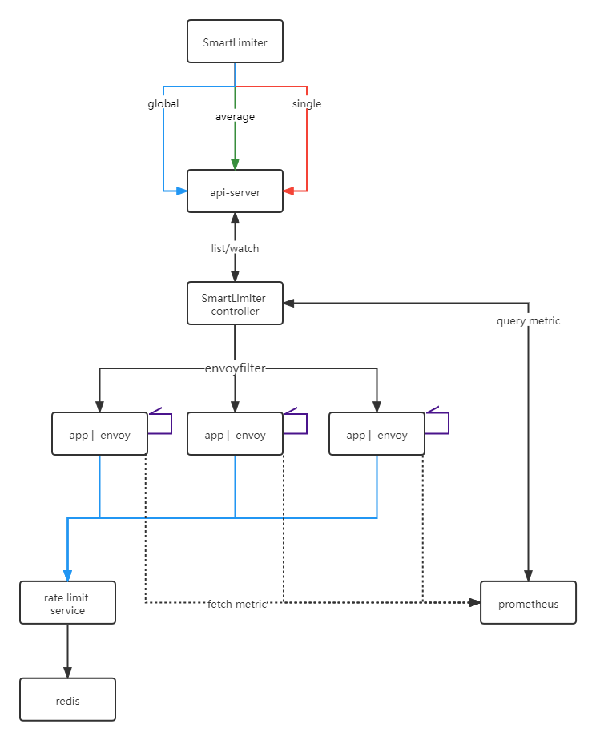

- [自适应限流概述](#自适应限流概述)
  - [背景](#背景)
  - [特点](#特点)
  - [功能](#功能)
  - [架构](#架构)
  - [样例](#样例)
  - [依赖](#依赖)
# 自适应限流概述

[EN](./README_EN.md)

## 背景

服务限流的目的是为了保护服务不被大量请求击垮，通过限制请求速率保护服务正常运行，在服务网格体系中，需要下发复杂的的EnvoyFilter才能完成限流。为了减轻用户使用难度，我们们推出了限流组件slime/limiter，用户只需提交贴近用户语义的SmartLimiter资源，即可完成限流规则的下发。

## 特点

1. 方便使用，只需提交`SmartLimiter`资源即可达到服务限流的目的。
2. 自适应限流，根据`pod`的资源使用量动态的触发限流规则。
3. 覆盖场景多，网格入口流量限流，网关出口流量限流
4. 支持功能多，支持全局共享限流，全局均分限流，单机限流。

## 实现
slime/limiter 组件监听smartlimiter资源，自动生成包含限流规则的envoyfilter。
- 对于网格场景，envoyfilter会下发给作为sidecar的envoy,在envoy的入口进行限流判断。
- 对于网关场景，envoyfilter被下发给作为router的envoy，在envoy的出口进行限流判断。

## 功能

目前slime/limiter模块支持以下几个类型的限流：

网格场景下：

1. 支持单机限流：对于指定的服务的每一个pod,都有一个固定的限流数值，使用的限流插件是http.local_ratelimit（限流计数器在本地), 详见[单机限流](./document/smartlimiter_zh.md#网格场景单机限流)
2. 支持全局均分限流：服务的所有pod，平均分配限流数，使用的限流插件是http.local_ratelimit（限流计数器在本地, 详见[全局均分限流](./document/smartlimiter_zh.md#网格场景全局均分限流)
3. 支持全局共享限流：服务的所有pod, 共享一个限流计数器，使用的限流插件是http.ratelimit（限流计数器在远端, 详见[全局共享限流](./document/smartlimiter_zh.md#网格场景全局共享限流)

网关场景下：
1. 支持单机限流，详见[单机限流](./document/smartlimiter_zh.md#网关场景单机限流)
2. 支持全局共享限流，详见[全局共享限流](./document/smartlimiter_zh.md#网关场景单机限流)

网格网关场景下支持限流类型如下

|      | 单机限流 | 全局均分限流 | 全局共享 |
| ---- | -------- | ------------ | -------- |
| 网格 | 支持     | 支持         | 支持     |
| 网关 | 支持     | -            | 支持     |

网格网关场景下支持限流方向如下

|      | 入方向限流 | 出方向限流               |
| ---- | ---------- | ------------------------ |
| 网格 | 支持       | 部分支持（单机限流） |
| 网关 | -          | 支持                     |

网格网关场景下一些功能的差异如下

|      | headerMatch | host限流 | serviceEntry |
| ---- | ---------------- | ---------- | ------------ |
| 网格 | 支持             | -          | 支持         |
| 网关 | 支持             | 支持       | -            |

## 架构

自适应限流的主体架构分为两个部分，一部分包括`SmartLimiter`到`EnvoyFilter`的逻辑转化，另一部分包括集群内监控数据的获取，包括服务的`CPU`, `Memory`,`POD`数量等数据。

## 样例

`SmartLimiter`的CRD定义的比较接近自然语义

例如，以下样例中，对review服务的9080端口设置限流规则 10次/s [实践](./document/smartlimiter_zh.md#实践)

~~~yaml
apiVersion: microservice.slime.io/v1alpha2
kind: SmartLimiter
metadata:
  name: review
  namespace: default
spec:
  sets:
    v1:
      descriptor:
      - action:
          fill_interval:
            seconds: 1
          quota: "10"
          strategy: "single"
        condition: "true"
        target:
          port: 9080
~~~

## 依赖
1. 依赖 `Prometheus`可选,如果不需支持自适应限流，无需安装， [prometheus安装](./document/smartlimiter_zh.md#安装-prometheus)
2. 依赖 `RLS`，可选，如果不需要支持全局共享限流，无需安装，[RLS安装](./document/smartlimiter_zh.md#安装-rls--redis)

更多详细信息可以参考 [limiter](./document/smartlimiter_zh.md#自适应限流模块)