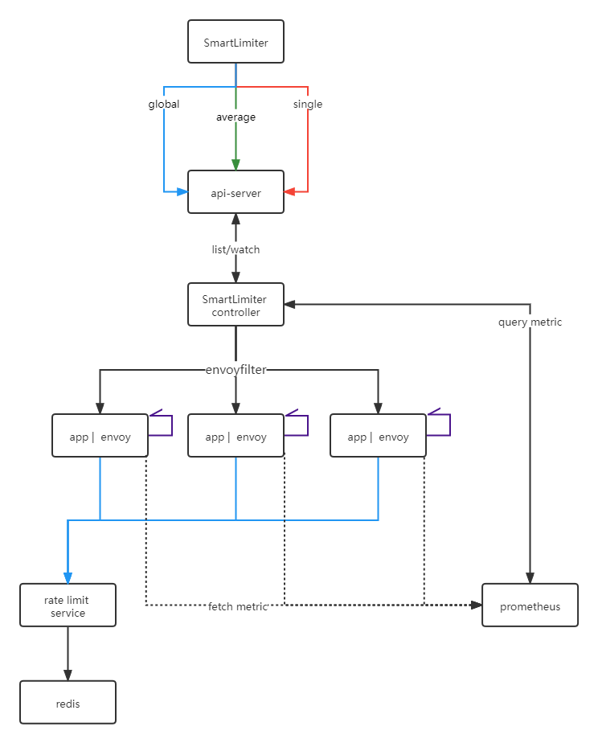

- [自适应限流概述](#自适应限流概述)
  - [背景](#背景)
  - [特点](#特点)
  - [功能](#功能)
  - [思路](#思路)
  - [架构](#架构)
  - [样例](#样例)
  - [依赖](#依赖)
# 自适应限流概述

[EN](./README.md)

## 背景

在网格中，为了配置限流规则用户不得不面对复杂的`EnvoyFilter`配置，为了解决这个问题，我们们推出了自适应限流组件`slime/limiter`。用户只需要提交符合我们定义的`SmartLimiter`，即可完成灵活的服务限流要求。[安装和使用](./document/smartlimiter_zh.md#安装和使用)

## 特点

1. 方便使用，只需提交`SmartLimiter`资源即可达到服务限流的目的。
2. 自适应限流，根据`pod`的资源使用量动态的触发限流规则。
3. 覆盖场景多，支持全局共享限流，全局均分限流，单机限流。

## 功能
1. 单机限流，每个pod单独的计数器
2. 全局共享限流，所有pod共享一个全局计数器
3. 全局均分限流，所有pod均分计数。
[功能](./document/smartlimiter_zh.md#smartlimiter)

## 思路

为了让用户从复杂的`EnvoyFilter`配置中脱离出来，我们利用`kubernetes`的`CRD`机制定义了一套简便的`API`，即`kubernetes`内的`SmartLimiter`资源。用户只需要按照`SmartLimiter`的规范提交一个`CR`,就会在集群中自动生成一个`EnvoyFilter`

## 架构

自适应限流的主体架构分为两个部分，一部分包括`SmartLimiter`到`EnvoyFilter`的逻辑转化，另一部分包括集群内监控数据的获取，包括服务的`CPU`, `Memory`,`POD`数量等数据。

## 样例

`SmartLimiter`的CRD定义的比较接近自然语义，例如，希望当`reviews`服务的`v1`版本的服务消耗`cpu`总量大于10的时候，触发限流，让其每个`POD`的9080端口的服务每秒钟只能处理10次请求。 [实践](./document/smartlimiter_zh.md#实践)

~~~yaml
apiVersion: microservice.slime.io/v1alpha2
kind: SmartLimiter
metadata:
  name: review
  namespace: default
spec:
  sets:
    v1:
      descriptor:
      - action:
          fill_interval:
            seconds: 1
          quota: "10"
          strategy: "single"
        condition: "{{.v1.cpu.sum}}>10"
        target:
          port: 9080
~~~

## 依赖
1. 依赖 `Prometheus` , [prometheus安装](./document/smartlimiter_zh.md#安装-prometheus)
2. 依赖 `RLS` ,可选，[RLS安装](./document/smartlimiter_zh.md#安装-rls--redis)
